# ECE 550D Project

9/6 - 9/11

# PC1 - Simple ALU

## Introduction

You will design and simulate an ALU using Verilog. You must support: 

- a non-RCA adder with support for addition & subtraction

## Module Interface 

> Designs which do not adhere to the following specification will incur significant penalties. 

Your module must use the following interface (n.b. It is the template provided to you in alu.v): 

```verilog
module alu(data_operandA, data_operandB, ctrl_ALUopcode, ctrl_shiftamt, data_result, isNotEqual, isLessThan, overflow); 
    input [31:0] data_operandA, data_operandB; 
    input [4:0] ctrl_ALUopcode, ctrl_shiftamt; 
    output [31:0] data_result; 
    output isNotEqual, isLessThan, overflow; 
endmodule
```

Both `data_operandA` and `data_operandB` are signed, therefore, we need to confirm whether an **overflow** happens or not. Please utilize **2’s complement** for the operations.

### Control Signals (In)
- **ctrl_ALUopcode**

  - Each operation should be associated with the following ALU opcodes:

    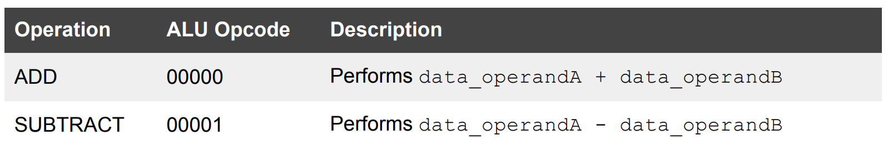

- **ctrl_shiftamt** 

  - Shift amount for SLL and SRA operations
  - Only needs to be used in SLL and SRA operations ==(not required for this checkpoint)==

### Information Signals (Out)
- **isNotEqual** ==(not required for this checkpoint)==
  - Asserts true **iff**  `data_operandA` and `data_operandB` are not equal
  - Only needs to be correct after a SUBTRACT operation

- **isLessThan **==(not required for this checkpoint)==
  - Asserts true **iff**  `data_operandA` is **strictly** less than `data_operandB`
  - Only needs to be correct after a SUBTRACT operation

- **overflow**
  - Asserts true **iff**  there is an overflow in ADD or SUBTRACT
  - Only needs to be correct after an ADD or SUBTRACT operation

## My Design

### 1. 32-bit adder：`CSA_32`

> 综合考虑简洁性和性能，采用四个 8-bit RCA 组成的 32-bit CSA

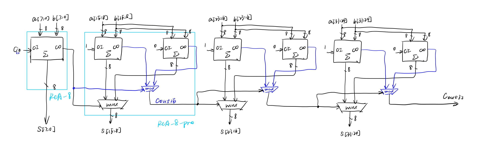

Below are the details of the structure:

- **Full Adder (`full_adder(a, b, cin, s, cout)`)**:
  - Inputs: `a`, `b` (operands), `cin` (carry-in)
  - Outputs: `s` (sum), `cout` (carry-out)
- **8-bit RCA (`RCA_8bit(a, b, cin, s, cout, overflow)`)**:
  - Built using 8 Full Adders.
  - `overflow` output is included for ALU integration.
- **8-bit RCA with carry prediction (`RCA_8bit_pro`)**:
  - An enhanced RCA with `cin` prediction.
- **2:1 Mux**:
  - Both 8-bit and 2-bit 2:1 multiplexers are used.
  - Implemented using conditional assignments.
- **32-bit CSA (`CSA_32bit`)**:
  - Created by combining four 8-bit RCAs.
  - Compared to a 32-bit RCA, this design reduces delay with a tolerable amount of additional hardware

#### 1.1 full_adder

```verilog
module full_adder(a, b, cin, s, cout);
	input a, b, cin;
	output s, cout;
	wire w1, w2, w3;
	
   	xor (w1, a, b);
   	xor (s, w1, cin);
   	and (w2, w1, cin);
   	and (w3, a, b);
   	or (cout, w2, w3);
	
endmodule
```

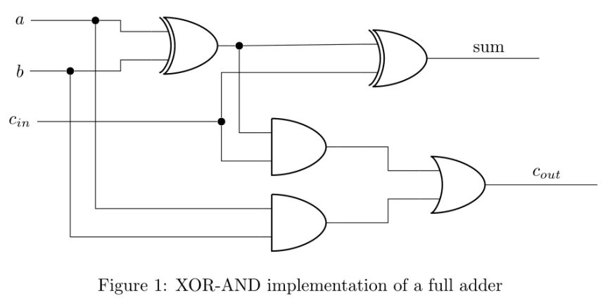

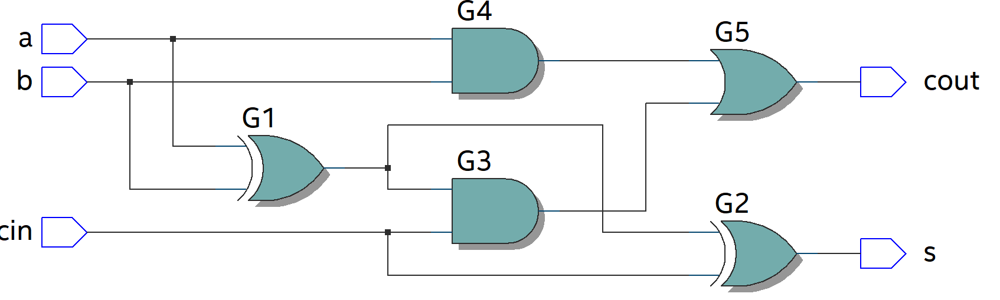

###### Waveform：

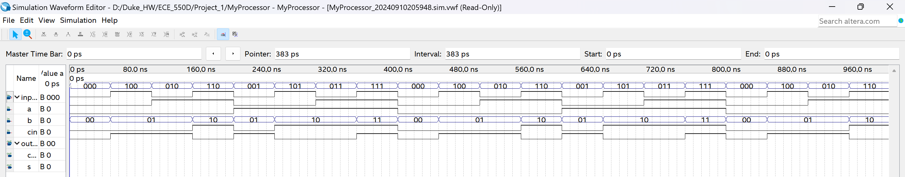

#### 1.2 RCA_8bit:

```verilog
module RCA_8bit(a, b, cin, s, cout);
	input [7:0] a, b;
	input cin;
	output [7:0] s;
	output cout;
	
	wire w1, w2, w3, w4, w5, w6, w7;
	
	full_adder FA0(.a(a[0]), .b(b[0]), .cin(cin), .s(s[0]), .cout(w1));
	full_adder FA1(.a(a[1]), .b(b[1]), .cin(w1), .s(s[1]), .cout(w2));
	full_adder FA2(.a(a[2]), .b(b[2]), .cin(w2), .s(s[2]), .cout(w3));
	full_adder FA3(.a(a[3]), .b(b[3]), .cin(w3), .s(s[3]), .cout(w4));
	full_adder FA4(.a(a[4]), .b(b[4]), .cin(w4), .s(s[4]), .cout(w5));
	full_adder FA5(.a(a[5]), .b(b[5]), .cin(w5), .s(s[5]), .cout(w6));
	full_adder FA6(.a(a[6]), .b(b[6]), .cin(w6), .s(s[6]), .cout(w7));
	full_adder FA7(.a(a[7]), .b(b[7]), .cin(w7), .s(s[7]), .cout(cout));
	
endmodule
```

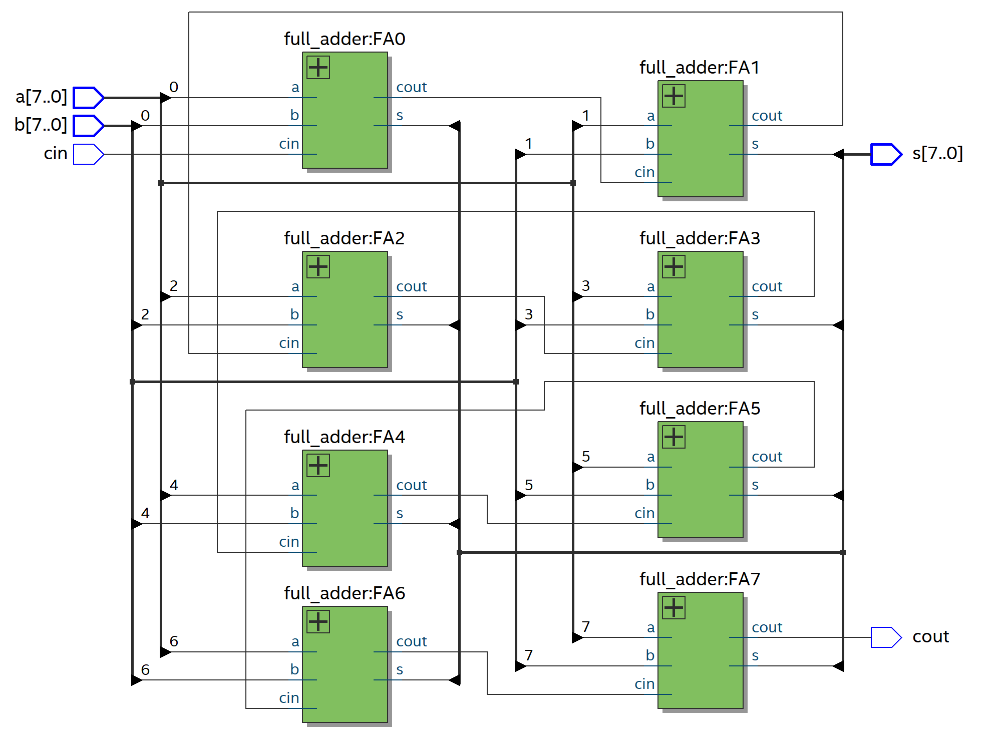

###### Waveform1：

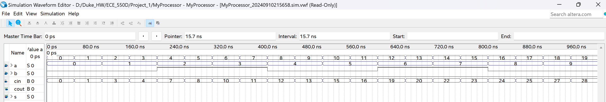

#### 1.3 RCA_8bit_pro:

```verilog
module RCA_8bit_pro(a, b, cin, s, cout);
	input [7:0] a, b;
	input cin;
	output [7:0] s;
	output cout;
	
	wire CO_1, CO_0;
	wire [7:0] s_1, s_0;
	
	RCA_8bit RCA_1(.a(a), .b(b), .cin(1), .s(s_1), .cout(CO_1));
	RCA_8bit RCA_0(.a(a), .b(b), .cin(0), .s(s_0), .cout(CO_0));
	
	assign s = cin ? s_1 : s_0;
	assign cout = cin ? CO_1 : CO_0;

endmodule
```

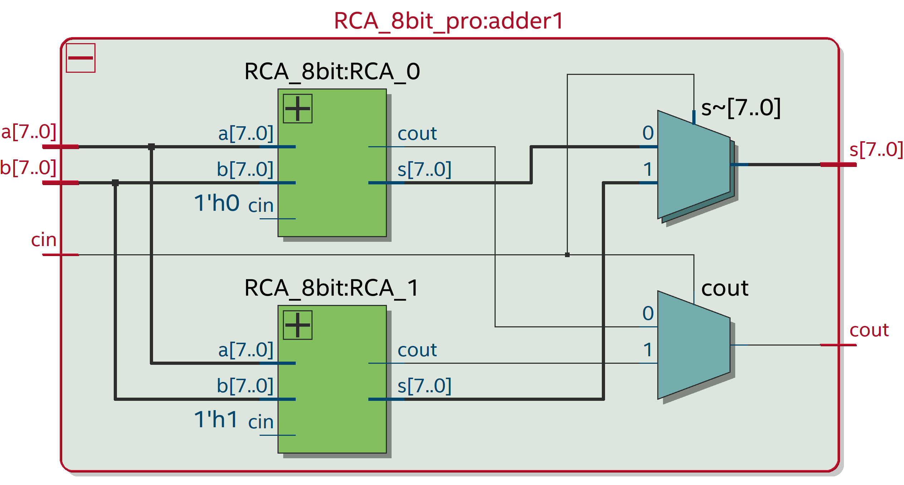

#### 1.4 CSA_32bit

```verilog
module CSA_32bit(a, b, cin, s, cout);
	input [31:0] a, b;
	input cin;
	output [31:0] s;
	output cout;
	
	wire w1, w2, w3;
	
	RCA_8bit adder0(.a(a[7:0]), .b(b[7:0]), .cin(cin), .s(s[7:0]), .cout(w1));
	RCA_8bit_pro adder1(.a(a[15:8]), .b(b[15:8]), .cin(w1), .s(s[15:8]), .cout(w2));
	RCA_8bit_pro adder2(.a(a[23:16]), .b(b[23:16]), .cin(w2), .s(s[23:16]), .cout(w3));
	RCA_8bit_pro adder3(.a(a[31:24]), .b(b[31:24]), .cin(w3), .s(s[31:24]), .cout(cout));

endmodule
```

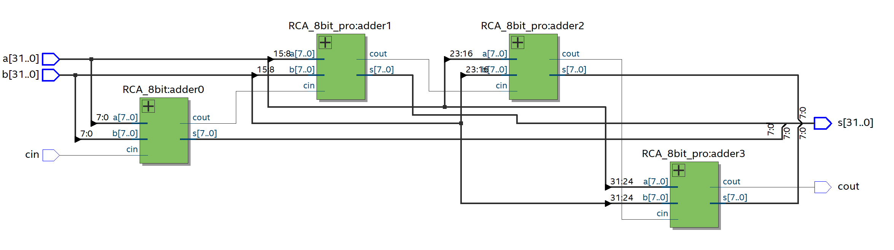

###### Waveform2：

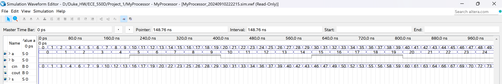

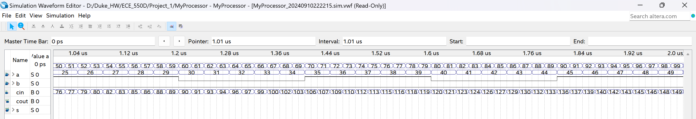

### 2. ALU `alu`

> No implementation of `ctrl_shiftamt`, `isNotEqual` ,`isLessThan`

#### 2.1 ALU - no overflow implementation

```verilog
module alu(data_operandA, data_operandB, ctrl_ALUopcode, ctrl_shiftamt, data_result, isNotEqual, isLessThan, overflow);

    input [31:0] data_operandA, data_operandB;
    input [4:0] ctrl_ALUopcode, ctrl_shiftamt;

    output [31:0] data_result;
    output isNotEqual, isLessThan, overflow;

   // YOUR CODE HERE //
    wire [31:0] wb_not, wb_res;
    wire w_cout;

    not G1(wb_not, data_operandB);
    assign wb_res = ctrl_ALUopcode[0] ? wb_not : data_operandB;

    CSA_32bit adder_32(.a(data_operandA), .b(wb_res), .cin(ctrl_ALUopcode[0]), .s(data_result), .cout(w_cout));
    
endmodule
```

> 注意：
>
> 1. `not()` 函数只能对一位进行操作，因此，`not G1(wb_not, data_operandB);` 这种写法是不对的，应该一位位操作。
> 2. cin 和 mux 的调节均是 `ctrl_ALUopcode[0]` 而非 `ctrl_ALUopcode`

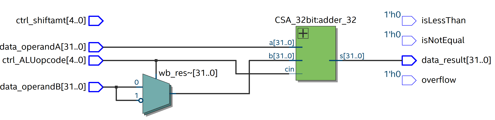

###### Waveform3：

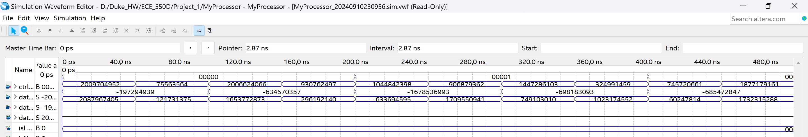

> 有些溢出的数据会不对。
>
> 这里显示的是 signed decimal，已经将二进制补码转换成十进制了。

#### 2.2 ALU - with overflow implementation


##### 预备知识：

> PPT03-26~27

- detect signed addition overflow: CI != CO of the last bit addition (XOR CI and CO of the last bit addition)

##### 思路：

- 在 `CSA_32bit` 上加一个指示是否溢出的输出 `overflow`，它可以直接连到 ALU 的 `overflow`
- 我们已经有第 31 位的 CO了，还需要第 31 位的 CI，这需要从前面每一级拉出来CI，但是由于CI没有实际意义，这样做不是很好。
- 但是，更好的方法是把每一级都做一个 overflow，这样更有意义。

##### 最终代码：

```verilog
module RCA_8bit(a, b, cin, s, cout, overflow);
	input [7:0] a, b;
	input cin;
	output [7:0] s;
	output cout, overflow;
	
	wire w1, w2, w3, w4, w5, w6, w7;
	
	// for overflow detection
	wire w_ovf;
	
	full_adder FA0(.a(a[0]), .b(b[0]), .cin(cin), .s(s[0]), .cout(w1));
	full_adder FA1(.a(a[1]), .b(b[1]), .cin(w1), .s(s[1]), .cout(w2));
	full_adder FA2(.a(a[2]), .b(b[2]), .cin(w2), .s(s[2]), .cout(w3));
	full_adder FA3(.a(a[3]), .b(b[3]), .cin(w3), .s(s[3]), .cout(w4));
	full_adder FA4(.a(a[4]), .b(b[4]), .cin(w4), .s(s[4]), .cout(w5));
	full_adder FA5(.a(a[5]), .b(b[5]), .cin(w5), .s(s[5]), .cout(w6));
	full_adder FA6(.a(a[6]), .b(b[6]), .cin(w6), .s(s[6]), .cout(w7));
	full_adder FA7(.a(a[7]), .b(b[7]), .cin(w7), .s(s[7]), .cout(cout));
	
	// for overflow detection
	xor (w_ovf, w7, cout);
	assign overflow = w_ovf;
	
endmodule
```

```verilog
module RCA_8bit_pro(a, b, cin, s, cout, overflow);
	input [7:0] a, b;
	input cin;
	output [7:0] s;
	output cout, overflow;
	
	wire CO_1, CO_0;
	wire [7:0] s_1, s_0;
	
	// for overflow detection
	wire w_ovf1, w_ovf0;
	
	RCA_8bit RCA_1(.a(a), .b(b), .cin(1), .s(s_1), .cout(CO_1), .overflow(w_ovf1));
	RCA_8bit RCA_0(.a(a), .b(b), .cin(0), .s(s_0), .cout(CO_0), .overflow(w_ovf0));
	
	assign s = cin ? s_1 : s_0;
	assign cout = cin ? CO_1 : CO_0;
	
	// for overflow detection
	assign overflow = cin ? w_ovf1 : w_ovf0;

endmodule
```

```verilog
module CSA_32bit(a, b, cin, s, cout, overflow);
	input [31:0] a, b;
	input cin;
	output [31:0] s;
	output cout, overflow;
	
	wire w1, w2, w3;
	
	// for overflow detection
	wire w_unused;	// unused wire can be connected together
	wire w_ovf;
	
	RCA_8bit adder0(.a(a[7:0]), .b(b[7:0]), .cin(cin), .s(s[7:0]), .cout(w1), .overflow(w_unused));
	RCA_8bit_pro adder1(.a(a[15:8]), .b(b[15:8]), .cin(w1), .s(s[15:8]), .cout(w2), .overflow(w_unused));
	RCA_8bit_pro adder2(.a(a[23:16]), .b(b[23:16]), .cin(w2), .s(s[23:16]), .cout(w3), .overflow(w_unused));
	RCA_8bit_pro adder3(.a(a[31:24]), .b(b[31:24]), .cin(w3), .s(s[31:24]), .cout(cout), .overflow(w_ovf));
	
	// for overflow detection
	assign overflow = w_ovf;
	
endmodule
```

```verilog
module alu(data_operandA, data_operandB, ctrl_ALUopcode, ctrl_shiftamt, data_result, isNotEqual, isLessThan, overflow);

   input [31:0] data_operandA, data_operandB;
   input [4:0] ctrl_ALUopcode, ctrl_shiftamt;

   output [31:0] data_result;
   output isNotEqual, isLessThan, overflow;

   // YOUR CODE HERE //
	wire [31:0] wb_not, wb_res;
	wire w_cout;
	
	// Perform bitwise NOT operation on each bit of data_operandB
   not G1(wb_not[0], data_operandB[0]);
   not G2(wb_not[1], data_operandB[1]);
   not G3(wb_not[2], data_operandB[2]);
   not G4(wb_not[3], data_operandB[3]);
   not G5(wb_not[4], data_operandB[4]);
   not G6(wb_not[5], data_operandB[5]);
   not G7(wb_not[6], data_operandB[6]);
   not G8(wb_not[7], data_operandB[7]);
   not G9(wb_not[8], data_operandB[8]);
   not G10(wb_not[9], data_operandB[9]);
   not G11(wb_not[10], data_operandB[10]);
   not G12(wb_not[11], data_operandB[11]);
   not G13(wb_not[12], data_operandB[12]);
   not G14(wb_not[13], data_operandB[13]);
   not G15(wb_not[14], data_operandB[14]);
   not G16(wb_not[15], data_operandB[15]);
   not G17(wb_not[16], data_operandB[16]);
   not G18(wb_not[17], data_operandB[17]);
   not G19(wb_not[18], data_operandB[18]);
   not G20(wb_not[19], data_operandB[19]);
   not G21(wb_not[20], data_operandB[20]);
   not G22(wb_not[21], data_operandB[21]);
   not G23(wb_not[22], data_operandB[22]);
   not G24(wb_not[23], data_operandB[23]);
   not G25(wb_not[24], data_operandB[24]);
   not G26(wb_not[25], data_operandB[25]);
   not G27(wb_not[26], data_operandB[26]);
   not G28(wb_not[27], data_operandB[27]);
   not G29(wb_not[28], data_operandB[28]);
   not G30(wb_not[29], data_operandB[29]);
   not G31(wb_not[30], data_operandB[30]);
   not G32(wb_not[31], data_operandB[31]);
	
	assign wb_res = ctrl_ALUopcode[0] ? wb_not : data_operandB;
	
	CSA_32bit adder_32(.a(data_operandA), .b(wb_res), .cin(ctrl_ALUopcode[0]), .s(data_result), .cout(w_cout), .overflow(overflow));
	

endmodule

```

###### NetListViewer:

ALU:

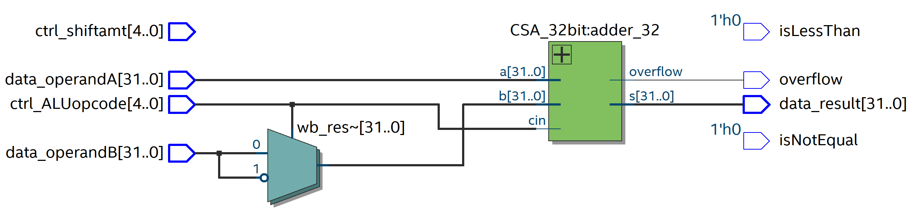

CSA_32bit:

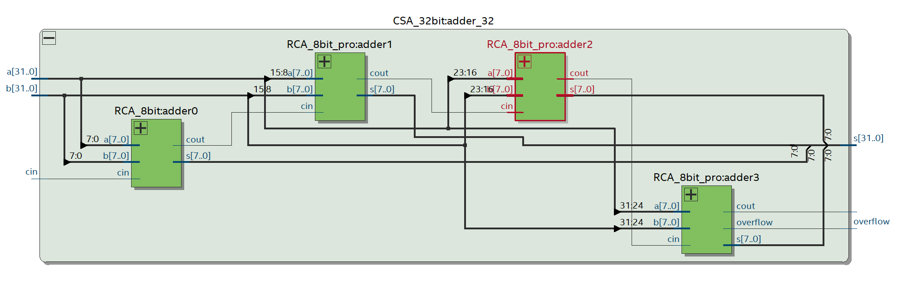

RCA_8bit_pro:

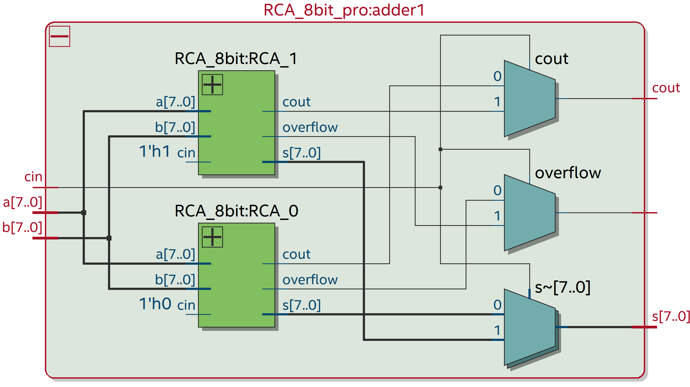

RCA_8bit:

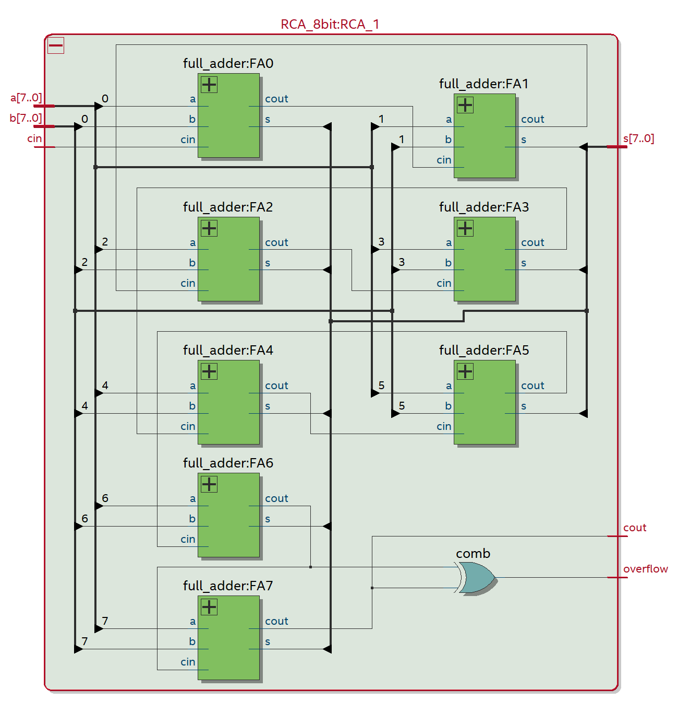

###### Waveform4:

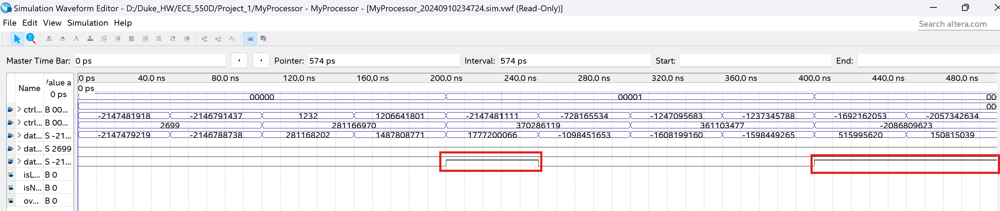

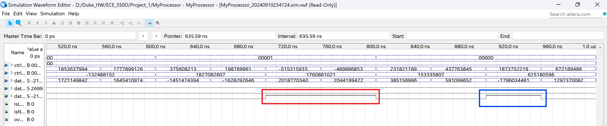

> 红色方框代表负数溢出，蓝色代表正数溢出

## Testbench

#### ALU_tb：

```verilog
`timescale 1 ns / 100 ps

module alu_tb();

    // inputs to the ALU are reg type

    reg            clock;
    reg [31:0] data_operandA, data_operandB, data_expected;
    reg [4:0] ctrl_ALUopcode, ctrl_shiftamt;


    // outputs from the ALU are wire type
    wire [31:0] data_result;
    wire isNotEqual, isLessThan, overflow;


    // Tracking the number of errors
    integer errors;
    integer index;    // for testing...


    // Instantiate ALU
    alu alu_ut(data_operandA, data_operandB, ctrl_ALUopcode, ctrl_shiftamt,
        data_result, isNotEqual, isLessThan, overflow);

    initial

    begin
        $display($time, " << Starting the Simulation >>");
        clock = 1'b0;    // at time 0
        errors = 0;

        //checkOr();
        //checkAnd();
        checkAdd();
        checkSub();
        //checkSLL();
        //checkSRA();

        //checkNE();
        //checkLT();
        checkOverflow();

        if(errors == 0) begin
            $display("The simulation completed without errors");
        end
        else begin
            $display("The simulation failed with %d errors", errors);
        end

        $stop;
    end

    // Clock generator
    always
         #10     clock = ~clock;

    task checkOr;
        begin
            @(negedge clock);
            assign ctrl_ALUopcode = 5'b00011;
            assign ctrl_shiftamt = 5'b00000;

            assign data_operandA = 32'h00000000;
            assign data_operandB = 32'h00000000;

            @(negedge clock);
            if(data_result !== 32'h00000000) begin
                $display("**Error in OR (test 1); expected: %h, actual: %h", 32'h00000000, data_result);
                errors = errors + 1;
            end

            @(negedge clock);
            assign data_operandA = 32'hFFFFFFFF;
            assign data_operandB = 32'h00000000;

            @(negedge clock);
            if(data_result !== 32'hFFFFFFFF) begin
                $display("**Error in OR (test 2); expected: %h, actual: %h", 32'hFFFFFFFF, data_result);
                errors = errors + 1;
            end

            @(negedge clock);
            assign data_operandA = 32'h00000000;
            assign data_operandB = 32'hFFFFFFFF;

            @(negedge clock);
            if(data_result !== 32'hFFFFFFFF) begin
                $display("**Error in OR (test 3); expected: %h, actual: %h", 32'hFFFFFFFF, data_result);
                errors = errors + 1;
            end

            @(negedge clock);
            assign data_operandA = 32'hFFFFFFFF;
            assign data_operandB = 32'hFFFFFFFF;

            @(negedge clock);
            if(data_result !== 32'hFFFFFFFF) begin
                $display("**Error in OR (test 4); expected: %h, actual: %h", 32'hFFFFFFFF, data_result);
                errors = errors + 1;
            end
        end
    endtask

    task checkAnd;
        begin
            @(negedge clock);
            assign ctrl_ALUopcode = 5'b00010;
            assign ctrl_shiftamt = 5'b00000;

            assign data_operandA = 32'h00000000;
            assign data_operandB = 32'h00000000;

            @(negedge clock);
            if(data_result !== 32'h00000000) begin
                $display("**Error in AND (test 5); expected: %h, actual: %h", 32'h00000000, data_result);
                errors = errors + 1;
            end

            @(negedge clock);
            assign data_operandA = 32'hFFFFFFFF;
            assign data_operandB = 32'h00000000;

            @(negedge clock);
            if(data_result !== 32'h00000000) begin
                $display("**Error in AND (test 6); expected: %h, actual: %h", 32'h00000000, data_result);
                errors = errors + 1;
            end

            @(negedge clock);
            assign data_operandA = 32'h00000000;
            assign data_operandB = 32'hFFFFFFFF;

            @(negedge clock);
            if(data_result !== 32'h00000000) begin
                $display("**Error in AND (test 7); expected: %h, actual: %h", 32'h00000000, data_result);
                errors = errors + 1;
            end

            @(negedge clock);
            assign data_operandA = 32'hFFFFFFFF;
            assign data_operandB = 32'hFFFFFFFF;

            @(negedge clock);
            if(data_result !== 32'hFFFFFFFF) begin
                $display("**Error in AND (test 8); expected: %h, actual: %h", 32'hFFFFFFFF, data_result);
                errors = errors + 1;
            end
        end
    endtask

    task checkAdd;
        begin
            @(negedge clock);
            assign ctrl_ALUopcode = 5'b00000;
            assign ctrl_shiftamt = 5'b00000;

            assign data_operandA = 32'h00000000;
            assign data_operandB = 32'h00000000;

            @(negedge clock);
            if(data_result !== 32'h00000000) begin
                $display("**Error in ADD (test 9); expected: %h, actual: %h", 32'h00000000, data_result);
                errors = errors + 1;
            end

            for(index = 0; index < 31; index = index + 1)
            begin
                @(negedge clock);
                assign data_operandA = 32'h00000001 << index;
                assign data_operandB = 32'h00000001 << index;

                assign data_expected = 32'h00000001 << (index + 1);

                @(negedge clock);
                if(data_result !== data_expected) begin
                    $display("**Error in ADD (test 17 part %d); expected: %h, actual: %h", index, data_expected, data_result);
                    errors = errors + 1;
                end
            end
        end
    endtask

    task checkSub;
        begin
            @(negedge clock);
            assign ctrl_ALUopcode = 5'b00001;
            assign ctrl_shiftamt = 5'b00000;

            assign data_operandA = 32'h00000000;
            assign data_operandB = 32'h00000000;

            @(negedge clock);
            if(data_result !== 32'h00000000) begin
                $display("**Error in SUB (test 10); expected: %h, actual: %h", 32'h00000000, data_result);
                errors = errors + 1;
            end
        end
    endtask

    task checkSLL;
        begin
            @(negedge clock);
            assign ctrl_ALUopcode = 5'b00100;
            assign data_operandB = 32'h00000000;

            assign data_operandA = 32'h00000001;
            assign ctrl_shiftamt = 5'b00000;

            @(negedge clock);
            if(data_result !== 32'h00000001) begin
                $display("**Error in SLL (test 11); expected: %h, actual: %h", 32'h00000001, data_result);
                errors = errors + 1;
            end

            for(index = 0; index < 5; index = index + 1)
            begin
                @(negedge clock);
                assign data_operandA = 32'h00000001;
                assign ctrl_shiftamt = 5'b00001 << index;

                assign data_expected = 32'h00000001 << (2**index);

                @(negedge clock);
                if(data_result !== data_expected) begin
                    $display("**Error in SLL (test 18 part %d); expected: %h, actual: %h", index, data_expected, data_result);
                    errors = errors + 1;
                end
            end

            for(index = 0; index < 4; index = index + 1)
            begin
                @(negedge clock);
                assign data_operandA = 32'h00000001;
                assign ctrl_shiftamt = 5'b00011 << index;

                assign data_expected = 32'h00000001 << ((2**index) + (2**(index + 1)));

                @(negedge clock);
                if(data_result !== data_expected) begin
                    $display("**Error in SLL (test 19 part %d); expected: %h, actual: %h", index, data_expected, data_result);
                    errors = errors + 1;
                end
            end
        end
    endtask

    task checkSRA;
        begin
            @(negedge clock);
            assign ctrl_ALUopcode = 5'b00101;
            assign data_operandB = 32'h00000000;

            assign data_operandA = 32'h00000000;
            assign ctrl_shiftamt = 5'b00000;

            @(negedge clock);
            if(data_result !== 32'h00000000) begin
                $display("**Error in SRA (test 12); expected: %h, actual: %h", 32'h00000000, data_result);
                errors = errors + 1;
            end
        end
    endtask

    task checkNE;
        begin
            @(negedge clock);
            assign ctrl_ALUopcode = 5'b00001;
            assign ctrl_shiftamt = 5'b00000;

            assign data_operandA = 32'h00000000;
            assign data_operandB = 32'h00000000;

            @(negedge clock);
            if(isNotEqual !== 1'b0) begin
                $display("**Error in isNotEqual (test 13); expected: %b, actual: %b", 1'b0, isNotEqual);
                errors = errors + 1;
            end
        end
    endtask

    task checkLT;
        begin
            @(negedge clock);
            assign ctrl_ALUopcode = 5'b00001;
            assign ctrl_shiftamt = 5'b00000;

            assign data_operandA = 32'h00000000;
            assign data_operandB = 32'h00000000;

            @(negedge clock);
            if(isLessThan !== 1'b0) begin
                $display("**Error in isLessThan (test 14); expected: %b, actual: %b", 1'b0, isLessThan);
                errors = errors + 1;
            end

            @(negedge clock);
            assign data_operandA = 32'h0FFFFFFF;
            assign data_operandB = 32'hFFFFFFFF;

            @(negedge clock);
            if(isLessThan !== 1'b0) begin
                $display("**Error in isLessThan (test 23); expected: %b, actual: %b", 1'b0, isLessThan);
                errors = errors + 1;
            end

            // Less than with overflow
            @(negedge clock);
            assign data_operandA = 32'h80000001;
            assign data_operandB = 32'h7FFFFFFF;

            @(negedge clock);
            if(isLessThan !== 1'b1) begin
                $display("**Error in isLessThan (test 24); expected: %b, actual: %b", 1'b1, isLessThan);
                errors = errors + 1;
            end
        end
    endtask

    task checkOverflow;
        begin
            @(negedge clock);
            assign ctrl_ALUopcode = 5'b00000;
            assign ctrl_shiftamt = 5'b00000;

            assign data_operandA = 32'h00000000;
            assign data_operandB = 32'h00000000;

            @(negedge clock);
            if(overflow !== 1'b0) begin
                $display("**Error in overflow (test 15); expected: %b, actual: %b", 1'b0, overflow);
                errors = errors + 1;
            end

            @(negedge clock);
            assign data_operandA = 32'h80000000;
            assign data_operandB = 32'h80000000;

            @(negedge clock);
            if(overflow !== 1'b1) begin
                $display("**Error in overflow (test 20); expected: %b, actual: %b", 1'b1, overflow);
                errors = errors + 1;
            end

            @(negedge clock);
            assign data_operandA = 32'h40000000;
            assign data_operandB = 32'h40000000;

            @(negedge clock);
            if(overflow !== 1'b1) begin
                $display("**Error in overflow (test 21); expected: %b, actual: %b", 1'b1, overflow);
                errors = errors + 1;
            end

            @(negedge clock);
            assign ctrl_ALUopcode = 5'b00001;

            assign data_operandA = 32'h00000000;
            assign data_operandB = 32'h00000000;

            @(negedge clock);
            if(overflow !== 1'b0) begin
                $display("**Error in overflow (test 16); expected: %b, actual: %b", 1'b0, overflow);
                errors = errors + 1;
            end

            @(negedge clock);
            assign data_operandA = 32'h80000000;
            assign data_operandB = 32'h80000000;

            @(negedge clock);
            if(overflow !== 1'b0) begin
                $display("**Error in overflow (test 22); expected: %b, actual: %b", 1'b0, overflow);
                errors = errors + 1;
            end

            @(negedge clock);
            assign data_operandA = 32'h80000000;
            assign data_operandB = 32'h0F000000;

            @(negedge clock);
            if(overflow !== 1'b1) begin
                $display("**Error in overflow (test 25); expected: %b, actual: %b", 1'b1, overflow);
                errors = errors + 1;
            end
        end
    endtask

endmodule
```

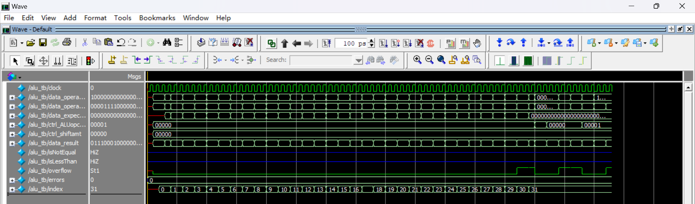

> errors remains 0, the result is correct.

# PC2 - Full ALU

> Guidance：[Writing Reusable Verilog Code using Generate and Parameters](https://fpgatutorial.com/verilog-generate/)

## Introduction 

Design and simulate an ALU using Verilog. You must support: 

- a non-RCA adder with support for addition & subtraction (that you have done in the last checkpoint) 
- bitwise AND, OR without the built-in &, &&, |, and || operators 
- 32-bit barrel shifter with SLL **(Logical Left Shift)** and SRA **(==Arithmetic== Right Shift)** without the <<, <<<, >>, and >>> operators

Each operation should be associated with the following ALU opcodes:

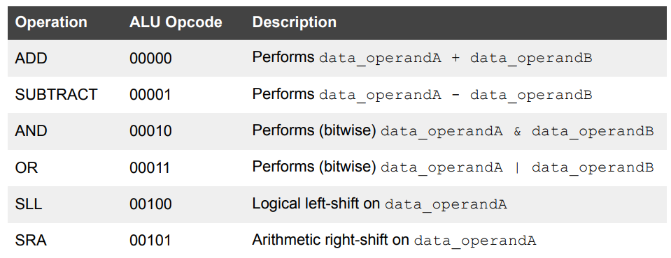

### Control Signals (In)
- **ctrl_shiftamt**
  - Shift amount for SLL and SRA operations
  - Only needs to be used in SLL and SRA operations

### Information Signals (Out)

- **isNotEqual**
  - Asserts true if and only if `data_operandA` and `data_operandB` are not equal
  - Only needs to be correct after a SUBTRACT operation
- **isLessThan**
  - Asserts true if and only if `data_operandA` is strictly less than `data_operandB`
  - Only needs to be correct after a SUBTRACT operation
- **overflow**
  - Asserts true if and only if there is an overflow in ADD or SUBTRACT
  - Only needs to be correct after an ADD or SUBTRACT operation

### You can use
- **Ternary assign:**  `assign out = cond ? high : low;`  (`cond`, `high`, and `low` must be wire(s) or input/output ports, you should not write an expression in `cond`)  
  - For example:  
  - `assign data_result = (ctrl_ALUopcode == 2'b00000) ? Add_result : Sub_result;`  You ==cannot== use `==` here, because you should not write an expression in `cond`.
  
- **Primitive instantiation:**  `and (out, in1, in2)`
  
- **Bitwise not (~)**

- **Generate Blocks:**  `generate if`, `generate for`, `genvar`  (This is a tutorial if you do not know them: [https://fpgatutorial.com/verilog-generate/](https://fpgatutorial.com/verilog-generate/))
  
- **RCAs** to construct your 32-bit adder, as long as the 32-bit adder is not RCA.

- **Parameters:**  `parameter a=0;`  `localparam b = a*2;`
  
- **Any expression you like inside the range specifier:**  `a[i*15+36/2-13%2]`

## My Design

### ALU:

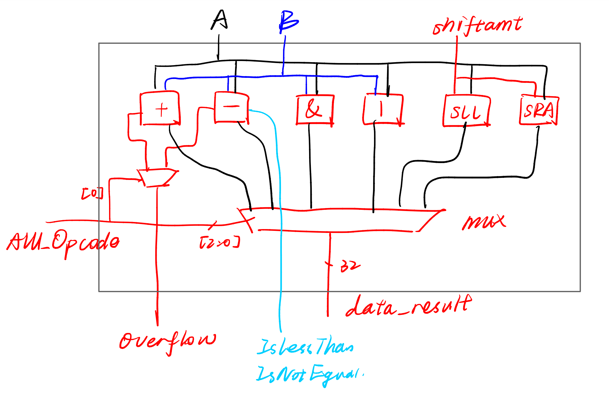

Design Idea:

- Each operating module performs its own operation in parallel.
- `ctrl_ALUopcode` is used as the select signal of the mux, outputting the result from the only one selected module. 
- For preciseness and clear structure, each operating module is well encapsulated.

```verilog
module alu(data_operandA, data_operandB, ctrl_ALUopcode, ctrl_shiftamt, data_result, isNotEqual, isLessThan, overflow);

   input [31:0] data_operandA, data_operandB;
   input [4:0] ctrl_ALUopcode, ctrl_shiftamt;

   output [31:0] data_result;
   output isNotEqual, isLessThan, overflow;
	
	wire ovf_add, ovf_sub, cout_add, cout_sub;
	wire [31:0] res_add, res_sub, res_and, res_or, res_sll, res_sra;
	
	ADD _add(.a(data_operandA), .b(data_operandB), .cin(ctrl_ALUopcode[0]), .s(res_add), .cout(cout_add), .overflow(ovf_add));	//00000
	SUB _sub(.a(data_operandA), .b(data_operandB), .cin(ctrl_ALUopcode[0]), .s(res_sub), .cout(cout_sub), .overflow(ovf_sub), .isNotEqual(isNotEqual), .isLessThan(isLessThan)); //00001
	alu_AND _and(.a(data_operandA), .b(data_operandB), .res(res_and));	//00010
	alu_OR _or(.a(data_operandA), .b(data_operandB), .res(res_or));	//00011
	SLL _sll(.a(data_operandA), .ctrl_shiftamt(ctrl_shiftamt), .res(res_sll)); //00100
	SRA _sra(.a(data_operandA), .ctrl_shiftamt(ctrl_shiftamt), .res(res_sra));	//00101
	
	mux8_32bit _res(.select(ctrl_ALUopcode[2:0]), .in7(32'h00000000), .in6(32'h00000000), .in5(res_sra), .in4(res_sll), .in3(res_or), .in2(res_and), .in1(res_sub), .in0(res_add), .data_out(data_result));
	
	assign overflow = (ctrl_ALUopcode[0]) ? ovf_sub : ovf_add;
	

endmodule
```

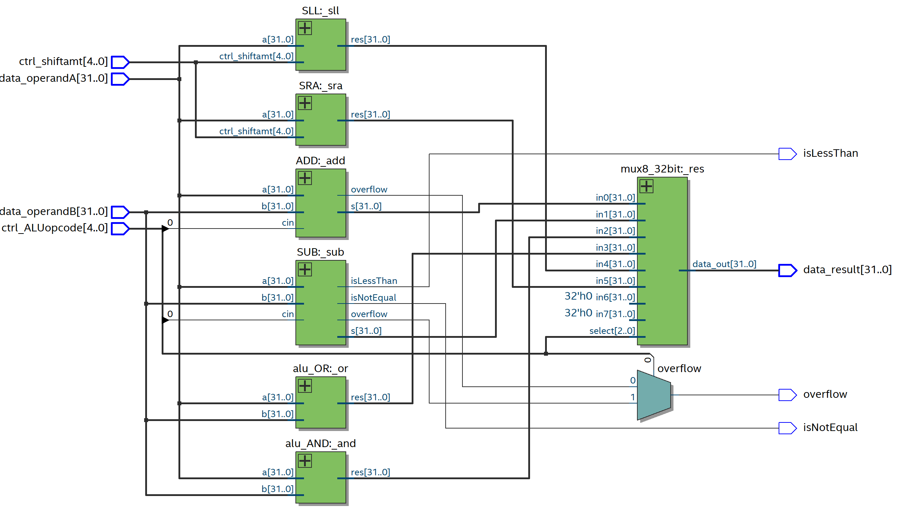

#### Mux8_32bit

```verilog
module mux8_32bit(select, in7, in6, in5, in4, in3, in2, in1, in0, data_out);

	input [31:0] in7, in6, in5, in4, in3, in2, in1, in0;
	input [2:0] select;
	output [31:0] data_out;
	
	
	assign data_out = select[2] ? (
								select[1] ? (
									select[0] ? in7 : in6
								) : (
									select[0] ? in5 : in4
								)
							) : (
								select[1] ? (
									select[0] ? in3 : in2
								) :(
									select[0] ? in1 : in0
								)
							);
//	assign data_out = select[2] ? 
//                    (select[1] ? (select[0] ? in7 : in6) : (select[0] ? in5 : in4)) :
//                    (select[1] ? (select[0] ? in3 : in2) : (select[0] ? in1 : in0));

	
endmodule
```

### ADD:

The `ADD` module is a simple encapsulation of the `CSA_32bit`.

```verilog
module ADD(a, b, cin, s, cout, overflow);
	input [31:0] a,b;
	input cin;
	output [31:0] s;
	output cout, overflow;
	
	CSA_32bit add_32(.a(a), .b(b), .cin(cin), .s(s), .cout(cout), .overflow(overflow));

endmodule
```

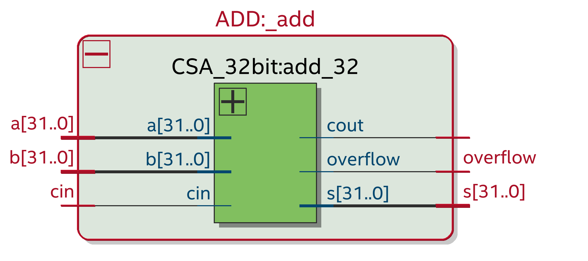

### SUB:

The `ADD` module is also an encapsulation of the `CSA_32bit`.

- subtraction is implemented by the formula $-B = !B + 1$, where 1 comes from the last bit of subtraction’s opcode.

  - Here, generate for loop is used to calculate !B.

- `overflow` detection is the same as the `ADD` module and `CSA_32bit` module.

- `isNotEqual` is implemented by “OR”ing each bit of the result `s`. If `s == 0` then a equals b.

- `isLessThan` is the most tricky par as we should take overflow into consideration.

  - As overflow in subtraction happens only when the two operands have different sign bits, and two operands with different sign bits can be easily compared according to their sign bits, we can lead to the following formula:

  - ```cpp
    if (different_sign) {isLessThan = (a[31] == 1);}	// different sign bits, might overflow. neg number < pos number.
    else {isLessThan = s[31];}	// no overflow, just look at the sign bit of the result.
    ```

```verilog
module SUB(a, b, cin, s, cout, overflow, isNotEqual, isLessThan);
	input [31:0] a,b;
	input cin;
	output [31:0] s;
	output cout, overflow, isNotEqual, isLessThan;
	
	
	CSA_32bit sub_32(.a(a), .b(~b), .cin(cin), .s(s), .cout(cout), .overflow(overflow));
	
	// deal with isLessThan with overflow
	wire ds;
	xor G_DS(ds, a[31], b[31]);
	wire w1, w2;
	assign w1 = a[31] ? 1'b1 : 1'b0;
	assign w2 = s[31] ? 1'b1 : 1'b0;
	assign isLessThan = ds ? w1 : w2;
	// sign bit is s[31], not cout!
	
	wire [31:0] temp_or;
	
	or G0(temp_or[0], 1'b0, s[0]);	// temp_or[0] = s[0]
	genvar i;
	generate
	  for (i = 1; i < 32; i = i + 1) begin : or_chain
			or G(temp_or[i], temp_or[i-1], s[i]);  // temp_or[i] = temp_or[i-1] | s[i]
	  end
	endgenerate
	
	// temp_or[31] == 1 : true, not equal; temp_or[31] == 0: false, equal.
	assign isNotEqual = (temp_or[31]) ? 1'b1 : 1'b0;	

endmodule
```

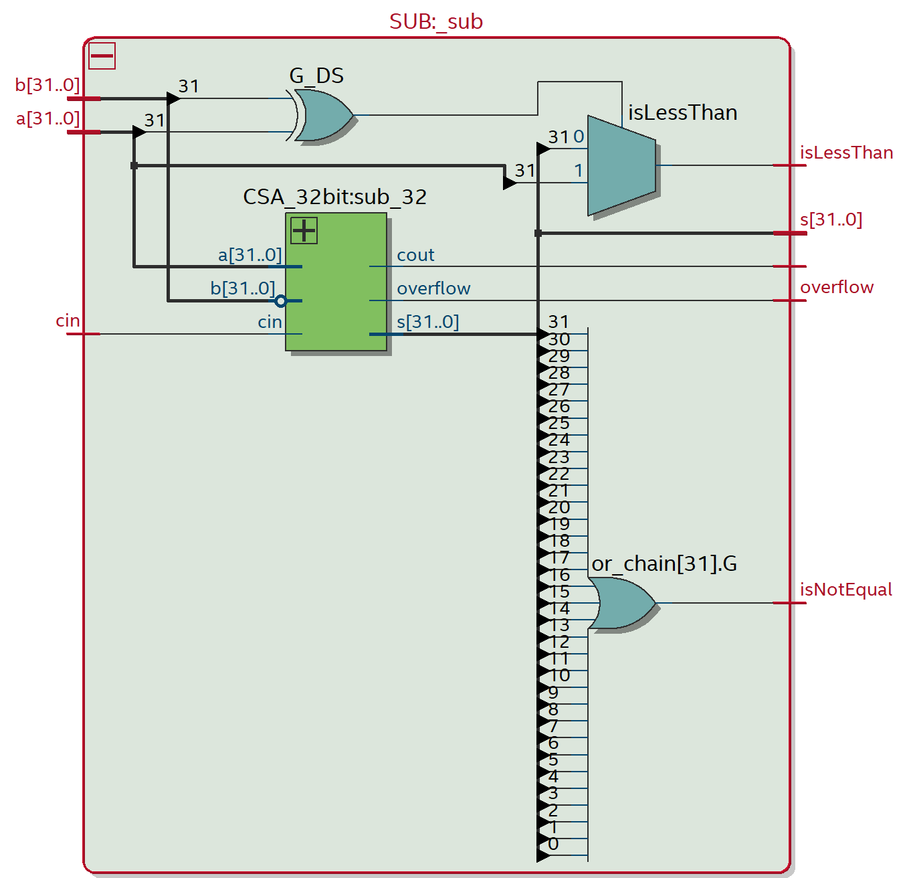

#### IsLessThan with Overflow Test Case:

```verilog
// Less than with overflow
@(negedge clock);
assign data_operandA = 32'h80000001;
assign data_operandB = 32'h7FFFFFFF;

@(negedge clock);
if(isLessThan !== 1'b1) begin
    $display("**Error in isLessThan (test 24); expected: %b, actual: %b", 1'b1, isLessThan);
    errors = errors + 1;
end
```

### alu_AND:

> `AND` is a reserved word in Verilog, we can’t name the module `AND`

Generate for is used in this module for preciseness.

```verilog
module alu_AND(a, b, res);
	input [31:0] a,b;
	output [31:0] res;
	
	genvar i;
	generate
	  for (i = 0; i < 32; i = i + 1) begin : and_by_bit
			and G(res[i], a[i], b[i]);  // res[i] = a[i] & b[i]
	  end
	endgenerate
endmodule
```

### alu_OR:

> `OR` is a reserved word in Verilog, we can’t name the module `OR`

Generate for is used in this module for preciseness.

```verilog
module alu_OR(a, b, res);
	input [31:0] a,b;
	output [31:0] res;
	
	genvar i;
	generate
	  for (i = 0; i < 32; i = i + 1) begin : and_by_bit
			or G(res[i], a[i], b[i]);  // res[i] = a[i] & b[i]
	  end
	endgenerate
	
endmodule
```

### SLL:

> SLL: fill the bits on the right side with 0.

A 5-level mux structure is used to implement the SLL.

- Each level represents whether to shift $2^{n-1}$ bits or not.

```verilog
module SLL(a, ctrl_shiftamt, res);
    input [31:0] a;            
    input [4:0] ctrl_shiftamt;
    output [31:0] res;  
    
    wire [31:0] s0, s1, s2, s3;

    // 1st level (1-bit left)
    assign s0[31] = (ctrl_shiftamt[0]) ? a[30] : a[31];
    assign s0[30] = (ctrl_shiftamt[0]) ? a[29] : a[30];
    assign s0[29] = (ctrl_shiftamt[0]) ? a[28] : a[29];
    assign s0[28] = (ctrl_shiftamt[0]) ? a[27] : a[28];
    assign s0[27] = (ctrl_shiftamt[0]) ? a[26] : a[27];
    assign s0[26] = (ctrl_shiftamt[0]) ? a[25] : a[26];
    assign s0[25] = (ctrl_shiftamt[0]) ? a[24] : a[25];
    assign s0[24] = (ctrl_shiftamt[0]) ? a[23] : a[24];
    assign s0[23] = (ctrl_shiftamt[0]) ? a[22] : a[23];
    assign s0[22] = (ctrl_shiftamt[0]) ? a[21] : a[22];
    assign s0[21] = (ctrl_shiftamt[0]) ? a[20] : a[21];
    assign s0[20] = (ctrl_shiftamt[0]) ? a[19] : a[20];
    assign s0[19] = (ctrl_shiftamt[0]) ? a[18] : a[19];
    assign s0[18] = (ctrl_shiftamt[0]) ? a[17] : a[18];
    assign s0[17] = (ctrl_shiftamt[0]) ? a[16] : a[17];
    assign s0[16] = (ctrl_shiftamt[0]) ? a[15] : a[16];
    assign s0[15] = (ctrl_shiftamt[0]) ? a[14] : a[15];
    assign s0[14] = (ctrl_shiftamt[0]) ? a[13] : a[14];
    assign s0[13] = (ctrl_shiftamt[0]) ? a[12] : a[13];
    assign s0[12] = (ctrl_shiftamt[0]) ? a[11] : a[12];
    assign s0[11] = (ctrl_shiftamt[0]) ? a[10] : a[11];
    assign s0[10] = (ctrl_shiftamt[0]) ? a[9] : a[10];
    assign s0[9]  = (ctrl_shiftamt[0]) ? a[8] : a[9];
    assign s0[8]  = (ctrl_shiftamt[0]) ? a[7] : a[8];
    assign s0[7]  = (ctrl_shiftamt[0]) ? a[6] : a[7];
    assign s0[6]  = (ctrl_shiftamt[0]) ? a[5] : a[6];
    assign s0[5]  = (ctrl_shiftamt[0]) ? a[4] : a[5];
    assign s0[4]  = (ctrl_shiftamt[0]) ? a[3] : a[4];
    assign s0[3]  = (ctrl_shiftamt[0]) ? a[2] : a[3];
    assign s0[2]  = (ctrl_shiftamt[0]) ? a[1] : a[2];
    assign s0[1]  = (ctrl_shiftamt[0]) ? a[0] : a[1];
    assign s0[0]  = (ctrl_shiftamt[0]) ? 1'b0 : a[0];

    // 2nd level (2-bit left)
    assign s1[31] = (ctrl_shiftamt[1]) ? s0[29] : s0[31];
    assign s1[30] = (ctrl_shiftamt[1]) ? s0[28] : s0[30];
    assign s1[29] = (ctrl_shiftamt[1]) ? s0[27] : s0[29];
    assign s1[28] = (ctrl_shiftamt[1]) ? s0[26] : s0[28];
    assign s1[27] = (ctrl_shiftamt[1]) ? s0[25] : s0[27];
    assign s1[26] = (ctrl_shiftamt[1]) ? s0[24] : s0[26];
    assign s1[25] = (ctrl_shiftamt[1]) ? s0[23] : s0[25];
    assign s1[24] = (ctrl_shiftamt[1]) ? s0[22] : s0[24];
    assign s1[23] = (ctrl_shiftamt[1]) ? s0[21] : s0[23];
    assign s1[22] = (ctrl_shiftamt[1]) ? s0[20] : s0[22];
    assign s1[21] = (ctrl_shiftamt[1]) ? s0[19] : s0[21];
    assign s1[20] = (ctrl_shiftamt[1]) ? s0[18] : s0[20];
    assign s1[19] = (ctrl_shiftamt[1]) ? s0[17] : s0[19];
    assign s1[18] = (ctrl_shiftamt[1]) ? s0[16] : s0[18];
    assign s1[17] = (ctrl_shiftamt[1]) ? s0[15] : s0[17];
    assign s1[16] = (ctrl_shiftamt[1]) ? s0[14] : s0[16];
    assign s1[15] = (ctrl_shiftamt[1]) ? s0[13] : s0[15];
    assign s1[14] = (ctrl_shiftamt[1]) ? s0[12] : s0[14];
    assign s1[13] = (ctrl_shiftamt[1]) ? s0[11] : s0[13];
    assign s1[12] = (ctrl_shiftamt[1]) ? s0[10] : s0[12];
    assign s1[11] = (ctrl_shiftamt[1]) ? s0[9]  : s0[11];
    assign s1[10] = (ctrl_shiftamt[1]) ? s0[8]  : s0[10];
    assign s1[9]  = (ctrl_shiftamt[1]) ? s0[7]  : s0[9];
    assign s1[8]  = (ctrl_shiftamt[1]) ? s0[6]  : s0[8];
    assign s1[7]  = (ctrl_shiftamt[1]) ? s0[5]  : s0[7];
    assign s1[6]  = (ctrl_shiftamt[1]) ? s0[4]  : s0[6];
    assign s1[5]  = (ctrl_shiftamt[1]) ? s0[3]  : s0[5];
    assign s1[4]  = (ctrl_shiftamt[1]) ? s0[2]  : s0[4];
    assign s1[3]  = (ctrl_shiftamt[1]) ? s0[1]  : s0[3];
    assign s1[2]  = (ctrl_shiftamt[1]) ? s0[0]  : s0[2];
    assign s1[1]  = (ctrl_shiftamt[1]) ? 1'b0   : s0[1];
    assign s1[0]  = (ctrl_shiftamt[1]) ? 1'b0   : s0[0];

    // 3rd level (4-bit left)
    assign s2[31] = (ctrl_shiftamt[2]) ? s1[27] : s1[31];
    assign s2[30] = (ctrl_shiftamt[2]) ? s1[26] : s1[30];
    assign s2[29] = (ctrl_shiftamt[2]) ? s1[25] : s1[29];
    assign s2[28] = (ctrl_shiftamt[2]) ? s1[24] : s1[28];
    assign s2[27] = (ctrl_shiftamt[2]) ? s1[23] : s1[27];
    assign s2[26] = (ctrl_shiftamt[2]) ? s1[22] : s1[26];
    assign s2[25] = (ctrl_shiftamt[2]) ? s1[21] : s1[25];
    assign s2[24] = (ctrl_shiftamt[2]) ? s1[20] : s1[24];
    assign s2[23] = (ctrl_shiftamt[2]) ? s1[19] : s1[23];
    assign s2[22] = (ctrl_shiftamt[2]) ? s1[18] : s1[22];
    assign s2[21] = (ctrl_shiftamt[2]) ? s1[17] : s1[21];
    assign s2[20] = (ctrl_shiftamt[2]) ? s1[16] : s1[20];
    assign s2[19] = (ctrl_shiftamt[2]) ? s1[15] : s1[19];
    assign s2[18] = (ctrl_shiftamt[2]) ? s1[14] : s1[18];
    assign s2[17] = (ctrl_shiftamt[2]) ? s1[13] : s1[17];
    assign s2[16] = (ctrl_shiftamt[2]) ? s1[12] : s1[16];
    assign s2[15] = (ctrl_shiftamt[2]) ? s1[11] : s1[15];
    assign s2[14] = (ctrl_shiftamt[2]) ? s1[10] : s1[14];
    assign s2[13] = (ctrl_shiftamt[2]) ? s1[9]  : s1[13];
    assign s2[12] = (ctrl_shiftamt[2]) ? s1[8]  : s1[12];
    assign s2[11] = (ctrl_shiftamt[2]) ? s1[7]  : s1[11];
    assign s2[10] = (ctrl_shiftamt[2]) ? s1[6]  : s1[10];
    assign s2[9]  = (ctrl_shiftamt[2]) ? s1[5]  : s1[9];
    assign s2[8]  = (ctrl_shiftamt[2]) ? s1[4]  : s1[8];
    assign s2[7]  = (ctrl_shiftamt[2]) ? s1[3]  : s1[7];
    assign s2[6]  = (ctrl_shiftamt[2]) ? s1[2]  : s1[6];
    assign s2[5]  = (ctrl_shiftamt[2]) ? s1[1]  : s1[5];
    assign s2[4]  = (ctrl_shiftamt[2]) ? s1[0]  : s1[4];
    assign s2[3]  = (ctrl_shiftamt[2]) ? 1'b0   : s1[3];
    assign s2[2]  = (ctrl_shiftamt[2]) ? 1'b0   : s1[2];
    assign s2[1]  = (ctrl_shiftamt[2]) ? 1'b0   : s1[1];
    assign s2[0]  = (ctrl_shiftamt[2]) ? 1'b0   : s1[0];

    // 4th level (8-bit left)
    assign s3[31] = (ctrl_shiftamt[3]) ? s2[23] : s2[31];
    assign s3[30] = (ctrl_shiftamt[3]) ? s2[22] : s2[30];
    assign s3[29] = (ctrl_shiftamt[3]) ? s2[21] : s2[29];
    assign s3[28] = (ctrl_shiftamt[3]) ? s2[20] : s2[28];
    assign s3[27] = (ctrl_shiftamt[3]) ? s2[19] : s2[27];
	 assign s3[26] = (ctrl_shiftamt[3]) ? s2[18] : s2[26];
    assign s3[25] = (ctrl_shiftamt[3]) ? s2[17] : s2[25];
    assign s3[24] = (ctrl_shiftamt[3]) ? s2[16] : s2[24];
    assign s3[23] = (ctrl_shiftamt[3]) ? s2[15] : s2[23];
    assign s3[22] = (ctrl_shiftamt[3]) ? s2[14] : s2[22];
    assign s3[21] = (ctrl_shiftamt[3]) ? s2[13] : s2[21];
    assign s3[20] = (ctrl_shiftamt[3]) ? s2[12] : s2[20];
    assign s3[19] = (ctrl_shiftamt[3]) ? s2[11] : s2[19];
    assign s3[18] = (ctrl_shiftamt[3]) ? s2[10] : s2[18];
    assign s3[17] = (ctrl_shiftamt[3]) ? s2[9]  : s2[17];
    assign s3[16] = (ctrl_shiftamt[3]) ? s2[8]  : s2[16];
    assign s3[15] = (ctrl_shiftamt[3]) ? s2[7]  : s2[15];
    assign s3[14] = (ctrl_shiftamt[3]) ? s2[6]  : s2[14];
    assign s3[13] = (ctrl_shiftamt[3]) ? s2[5]  : s2[13];
    assign s3[12] = (ctrl_shiftamt[3]) ? s2[4]  : s2[12];
    assign s3[11] = (ctrl_shiftamt[3]) ? s2[3]  : s2[11];
    assign s3[10] = (ctrl_shiftamt[3]) ? s2[2]  : s2[10];
    assign s3[9]  = (ctrl_shiftamt[3]) ? s2[1]  : s2[9];
    assign s3[8]  = (ctrl_shiftamt[3]) ? s2[0]  : s2[8];
    assign s3[7]  = (ctrl_shiftamt[3]) ? 1'b0   : s2[7];
    assign s3[6]  = (ctrl_shiftamt[3]) ? 1'b0   : s2[6];
    assign s3[5]  = (ctrl_shiftamt[3]) ? 1'b0   : s2[5];
    assign s3[4]  = (ctrl_shiftamt[3]) ? 1'b0   : s2[4];
    assign s3[3]  = (ctrl_shiftamt[3]) ? 1'b0   : s2[3];
    assign s3[2]  = (ctrl_shiftamt[3]) ? 1'b0   : s2[2];
    assign s3[1]  = (ctrl_shiftamt[3]) ? 1'b0   : s2[1];
    assign s3[0]  = (ctrl_shiftamt[3]) ? 1'b0   : s2[0];

    // 4th level (16-bit left)
    assign res[31] = (ctrl_shiftamt[4]) ? s3[15] : s3[31];
    assign res[30] = (ctrl_shiftamt[4]) ? s3[14] : s3[30];
    assign res[29] = (ctrl_shiftamt[4]) ? s3[13] : s3[29];
    assign res[28] = (ctrl_shiftamt[4]) ? s3[12] : s3[28];
    assign res[27] = (ctrl_shiftamt[4]) ? s3[11] : s3[27];
    assign res[26] = (ctrl_shiftamt[4]) ? s3[10] : s3[26];
    assign res[25] = (ctrl_shiftamt[4]) ? s3[9]  : s3[25];
    assign res[24] = (ctrl_shiftamt[4]) ? s3[8]  : s3[24];
    assign res[23] = (ctrl_shiftamt[4]) ? s3[7]  : s3[23];
    assign res[22] = (ctrl_shiftamt[4]) ? s3[6]  : s3[22];
    assign res[21] = (ctrl_shiftamt[4]) ? s3[5]  : s3[21];
    assign res[20] = (ctrl_shiftamt[4]) ? s3[4]  : s3[20];
    assign res[19] = (ctrl_shiftamt[4]) ? s3[3]  : s3[19];
    assign res[18] = (ctrl_shiftamt[4]) ? s3[2]  : s3[18];
    assign res[17] = (ctrl_shiftamt[4]) ? s3[1]  : s3[17];
    assign res[16] = (ctrl_shiftamt[4]) ? s3[0]  : s3[16];
    assign res[15] = (ctrl_shiftamt[4]) ? 1'b0   : s3[15];
    assign res[14] = (ctrl_shiftamt[4]) ? 1'b0   : s3[14];
    assign res[13] = (ctrl_shiftamt[4]) ? 1'b0   : s3[13];
    assign res[12] = (ctrl_shiftamt[4]) ? 1'b0   : s3[12];
    assign res[11] = (ctrl_shiftamt[4]) ? 1'b0   : s3[11];
    assign res[10] = (ctrl_shiftamt[4]) ? 1'b0   : s3[10];
    assign res[9]  = (ctrl_shiftamt[4]) ? 1'b0   : s3[9];
    assign res[8]  = (ctrl_shiftamt[4]) ? 1'b0   : s3[8];
    assign res[7]  = (ctrl_shiftamt[4]) ? 1'b0   : s3[7];
    assign res[6]  = (ctrl_shiftamt[4]) ? 1'b0   : s3[6];
    assign res[5]  = (ctrl_shiftamt[4]) ? 1'b0   : s3[5];
    assign res[4]  = (ctrl_shiftamt[4]) ? 1'b0   : s3[4];
    assign res[3]  = (ctrl_shiftamt[4]) ? 1'b0   : s3[3];
    assign res[2]  = (ctrl_shiftamt[4]) ? 1'b0   : s3[2];
    assign res[1]  = (ctrl_shiftamt[4]) ? 1'b0   : s3[1];
    assign res[0]  = (ctrl_shiftamt[4]) ? 1'b0   : s3[0];

endmodule
```

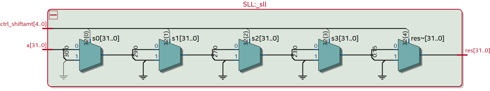

### SRA:

> SRA: fill the bits on the left side with sign bit.

A 5-level mux structure is used to implement the SRA.

- Each level represents whether to shift $2^{n-1}$ bits or not.

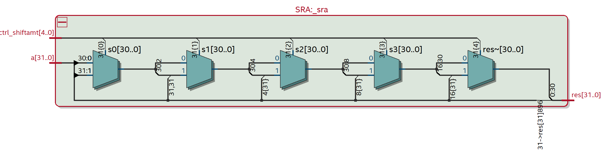

```verilog
module SRA(a, ctrl_shiftamt, res);
    input [31:0] a;            
    input [4:0] ctrl_shiftamt;     
    output [31:0] res;  
	
    wire [31:0] s0, s1, s2, s3;

    // sign bit
    wire sign_bit = a[31];

    // 1st level (1-bit right)
    assign s0[31] = (ctrl_shiftamt[0]) ? sign_bit : a[31];  // retain sign bit
    assign s0[30] = (ctrl_shiftamt[0]) ? a[31] : a[30];
    assign s0[29] = (ctrl_shiftamt[0]) ? a[30] : a[29];
    assign s0[28] = (ctrl_shiftamt[0]) ? a[29] : a[28];
    assign s0[27] = (ctrl_shiftamt[0]) ? a[28] : a[27];
    assign s0[26] = (ctrl_shiftamt[0]) ? a[27] : a[26];
    assign s0[25] = (ctrl_shiftamt[0]) ? a[26] : a[25];
    assign s0[24] = (ctrl_shiftamt[0]) ? a[25] : a[24];
    assign s0[23] = (ctrl_shiftamt[0]) ? a[24] : a[23];
    assign s0[22] = (ctrl_shiftamt[0]) ? a[23] : a[22];
    assign s0[21] = (ctrl_shiftamt[0]) ? a[22] : a[21];
    assign s0[20] = (ctrl_shiftamt[0]) ? a[21] : a[20];
    assign s0[19] = (ctrl_shiftamt[0]) ? a[20] : a[19];
    assign s0[18] = (ctrl_shiftamt[0]) ? a[19] : a[18];
    assign s0[17] = (ctrl_shiftamt[0]) ? a[18] : a[17];
    assign s0[16] = (ctrl_shiftamt[0]) ? a[17] : a[16];
    assign s0[15] = (ctrl_shiftamt[0]) ? a[16] : a[15];
    assign s0[14] = (ctrl_shiftamt[0]) ? a[15] : a[14];
    assign s0[13] = (ctrl_shiftamt[0]) ? a[14] : a[13];
    assign s0[12] = (ctrl_shiftamt[0]) ? a[13] : a[12];
    assign s0[11] = (ctrl_shiftamt[0]) ? a[12] : a[11];
    assign s0[10] = (ctrl_shiftamt[0]) ? a[11] : a[10];
    assign s0[9]  = (ctrl_shiftamt[0]) ? a[10] : a[9];
    assign s0[8]  = (ctrl_shiftamt[0]) ? a[9]  : a[8];
    assign s0[7]  = (ctrl_shiftamt[0]) ? a[8]  : a[7];
    assign s0[6]  = (ctrl_shiftamt[0]) ? a[7]  : a[6];
    assign s0[5]  = (ctrl_shiftamt[0]) ? a[6]  : a[5];
    assign s0[4]  = (ctrl_shiftamt[0]) ? a[5]  : a[4];
    assign s0[3]  = (ctrl_shiftamt[0]) ? a[4]  : a[3];
    assign s0[2]  = (ctrl_shiftamt[0]) ? a[3]  : a[2];
    assign s0[1]  = (ctrl_shiftamt[0]) ? a[2]  : a[1];
    assign s0[0]  = (ctrl_shiftamt[0]) ? a[1]  : a[0];

    // 2nd level (2-bit right)
    assign s1[31] = (ctrl_shiftamt[1]) ? sign_bit : s0[31]; 
    assign s1[30] = (ctrl_shiftamt[1]) ? sign_bit : s0[30];
    assign s1[29] = (ctrl_shiftamt[1]) ? s0[31] : s0[29];
    assign s1[28] = (ctrl_shiftamt[1]) ? s0[30] : s0[28];
    assign s1[27] = (ctrl_shiftamt[1]) ? s0[29] : s0[27];
    assign s1[26] = (ctrl_shiftamt[1]) ? s0[28] : s0[26];
    assign s1[25] = (ctrl_shiftamt[1]) ? s0[27] : s0[25];
    assign s1[24] = (ctrl_shiftamt[1]) ? s0[26] : s0[24];
    assign s1[23] = (ctrl_shiftamt[1]) ? s0[25] : s0[23];
    assign s1[22] = (ctrl_shiftamt[1]) ? s0[24] : s0[22];
    assign s1[21] = (ctrl_shiftamt[1]) ? s0[23] : s0[21];
    assign s1[20] = (ctrl_shiftamt[1]) ? s0[22] : s0[20];
    assign s1[19] = (ctrl_shiftamt[1]) ? s0[21] : s0[19];
    assign s1[18] = (ctrl_shiftamt[1]) ? s0[20] : s0[18];
    assign s1[17] = (ctrl_shiftamt[1]) ? s0[19] : s0[17];
    assign s1[16] = (ctrl_shiftamt[1]) ? s0[18] : s0[16];
    assign s1[15] = (ctrl_shiftamt[1]) ? s0[17] : s0[15];
    assign s1[14] = (ctrl_shiftamt[1]) ? s0[16] : s0[14];
    assign s1[13] = (ctrl_shiftamt[1]) ? s0[15] : s0[13];
    assign s1[12] = (ctrl_shiftamt[1]) ? s0[14] : s0[12];
    assign s1[11] = (ctrl_shiftamt[1]) ? s0[13] : s0[11];
    assign s1[10] = (ctrl_shiftamt[1]) ? s0[12] : s0[10];
    assign s1[9]  = (ctrl_shiftamt[1]) ? s0[11] : s0[9];
    assign s1[8]  = (ctrl_shiftamt[1]) ? s0[10] : s0[8];
    assign s1[7]  = (ctrl_shiftamt[1]) ? s0[9]  : s0[7];
    assign s1[6]  = (ctrl_shiftamt[1]) ? s0[8]  : s0[6];
    assign s1[5]  = (ctrl_shiftamt[1]) ? s0[7]  : s0[5];
    assign s1[4]  = (ctrl_shiftamt[1]) ? s0[6]  : s0[4];
    assign s1[3]  = (ctrl_shiftamt[1]) ? s0[5]  : s0[3];
    assign s1[2]  = (ctrl_shiftamt[1]) ? s0[4]  : s0[2];
    assign s1[1]  = (ctrl_shiftamt[1]) ? s0[3]  : s0[1];
    assign s1[0]  = (ctrl_shiftamt[1]) ? s0[2]  : s0[0];

    // 3rd level (4-bit right)
    assign s2[31] = (ctrl_shiftamt[2]) ? sign_bit : s1[31];
    assign s2[30] = (ctrl_shiftamt[2]) ? sign_bit : s1[30];
    assign s2[29] = (ctrl_shiftamt[2]) ? sign_bit : s1[29];
    assign s2[28] = (ctrl_shiftamt[2]) ? sign_bit : s1[28];
    assign s2[27] = (ctrl_shiftamt[2]) ? s1[31] : s1[27];
    assign s2[26] = (ctrl_shiftamt[2]) ? s1[30] : s1[26];
    assign s2[25] = (ctrl_shiftamt[2]) ? s1[29] : s1[25];
    assign s2[24] = (ctrl_shiftamt[2]) ? s1[28] : s1[24];
    assign s2[23] = (ctrl_shiftamt[2]) ? s1[27] : s1[23];
    assign s2[22] = (ctrl_shiftamt[2]) ? s1[26] : s1[22];
    assign s2[21] = (ctrl_shiftamt[2]) ? s1[25] : s1[21];
    assign s2[20] = (ctrl_shiftamt[2]) ? s1[24] : s1[20];
    assign s2[19] = (ctrl_shiftamt[2]) ? s1[23] : s1[19];
    assign s2[18] = (ctrl_shiftamt[2]) ? s1[22] : s1[18];
    assign s2[17] = (ctrl_shiftamt[2]) ? s1[21] : s1[17];
    assign s2[16] = (ctrl_shiftamt[2]) ? s1[20] : s1[16];
    assign s2[15] = (ctrl_shiftamt[2]) ? s1[19] : s1[15];
    assign s2[14] = (ctrl_shiftamt[2]) ? s1[18] : s1[14];
    assign s2[13] = (ctrl_shiftamt[2]) ? s1[17] : s1[13];
    assign s2[12] = (ctrl_shiftamt[2]) ? s1[16] : s1[12];
    assign s2[11] = (ctrl_shiftamt[2]) ? s1[15] : s1[11];
    assign s2[10] = (ctrl_shiftamt[2]) ? s1[14] : s1[10];
    assign s2[9]  = (ctrl_shiftamt[2]) ? s1[13] : s1[9];
    assign s2[8]  = (ctrl_shiftamt[2]) ? s1[12] : s1[8];
    assign s2[7]  = (ctrl_shiftamt[2]) ? s1[11] : s1[7];
    assign s2[6]  = (ctrl_shiftamt[2]) ? s1[10] : s1[6];
    assign s2[5]  = (ctrl_shiftamt[2]) ? s1[9]  : s1[5];
    assign s2[4]  = (ctrl_shiftamt[2]) ? s1[8]  : s1[4];
    assign s2[3]  = (ctrl_shiftamt[2]) ? s1[7]  : s1[3];
    assign s2[2]  = (ctrl_shiftamt[2]) ? s1[6]  : s1[2];
    assign s2[1]  = (ctrl_shiftamt[2]) ? s1[5]  : s1[1];
    assign s2[0]  = (ctrl_shiftamt[2]) ? s1[4]  : s1[0];

    // 4th level (8-bit right)
    assign s3[31] = (ctrl_shiftamt[3]) ? sign_bit : s2[31];  
    assign s3[30] = (ctrl_shiftamt[3]) ? sign_bit : s2[30];
    assign s3[29] = (ctrl_shiftamt[3]) ? sign_bit : s2[29];
    assign s3[28] = (ctrl_shiftamt[3]) ? sign_bit : s2[28]; 
    assign s3[27] = (ctrl_shiftamt[3]) ? sign_bit : s2[27];
    assign s3[26] = (ctrl_shiftamt[3]) ? sign_bit : s2[26]; 
    assign s3[25] = (ctrl_shiftamt[3]) ? sign_bit : s2[25]; 
    assign s3[24] = (ctrl_shiftamt[3]) ? sign_bit : s2[24];  
    assign s3[23] = (ctrl_shiftamt[3]) ? s2[31] : s2[23];
    assign s3[22] = (ctrl_shiftamt[3]) ? s2[30] : s2[22];
    assign s3[21] = (ctrl_shiftamt[3]) ? s2[29] : s2[21];
    assign s3[20] = (ctrl_shiftamt[3]) ? s2[28] : s2[20];
    assign s3[19] = (ctrl_shiftamt[3]) ? s2[27] : s2[19];
    assign s3[18] = (ctrl_shiftamt[3]) ? s2[26] : s2[18];
    assign s3[17] = (ctrl_shiftamt[3]) ? s2[25] : s2[17];
    assign s3[16] = (ctrl_shiftamt[3]) ? s2[24] : s2[16];
    assign s3[15] = (ctrl_shiftamt[3]) ? s2[23] : s2[15];
    assign s3[14] = (ctrl_shiftamt[3]) ? s2[22] : s2[14];
    assign s3[13] = (ctrl_shiftamt[3]) ? s2[21] : s2[13];
    assign s3[12] = (ctrl_shiftamt[3]) ? s2[20] : s2[12];
    assign s3[11] = (ctrl_shiftamt[3]) ? s2[19] : s2[11];
    assign s3[10] = (ctrl_shiftamt[3]) ? s2[18] : s2[10];
    assign s3[9]  = (ctrl_shiftamt[3]) ? s2[17] : s2[9];
    assign s3[8]  = (ctrl_shiftamt[3]) ? s2[16] : s2[8];
    assign s3[7]  = (ctrl_shiftamt[3]) ? s2[15] : s2[7];
    assign s3[6]  = (ctrl_shiftamt[3]) ? s2[14] : s2[6];
    assign s3[5]  = (ctrl_shiftamt[3]) ? s2[13] : s2[5];
    assign s3[4]  = (ctrl_shiftamt[3]) ? s2[12] : s2[4];
    assign s3[3]  = (ctrl_shiftamt[3]) ? s2[11] : s2[3];
    assign s3[2]  = (ctrl_shiftamt[3]) ? s2[10] : s2[2];
    assign s3[1]  = (ctrl_shiftamt[3]) ? s2[9]  : s2[1];
    assign s3[0]  = (ctrl_shiftamt[3]) ? s2[8]  : s2[0];
	 
	 // 5th level (16-bit right)
    assign res[31] = (ctrl_shiftamt[4]) ? sign_bit : s3[31];
    assign res[30] = (ctrl_shiftamt[4]) ? sign_bit : s3[30];
    assign res[29] = (ctrl_shiftamt[4]) ? sign_bit : s3[29];
    assign res[28] = (ctrl_shiftamt[4]) ? sign_bit : s3[28];
    assign res[27] = (ctrl_shiftamt[4]) ? sign_bit : s3[27];
    assign res[26] = (ctrl_shiftamt[4]) ? sign_bit : s3[26];
    assign res[25] = (ctrl_shiftamt[4]) ? sign_bit : s3[25];
    assign res[24] = (ctrl_shiftamt[4]) ? sign_bit : s3[24];
    assign res[23] = (ctrl_shiftamt[4]) ? sign_bit : s3[23];
    assign res[22] = (ctrl_shiftamt[4]) ? sign_bit : s3[22];
    assign res[21] = (ctrl_shiftamt[4]) ? sign_bit : s3[21];
    assign res[20] = (ctrl_shiftamt[4]) ? sign_bit : s3[20];
    assign res[19] = (ctrl_shiftamt[4]) ? sign_bit : s3[19];
    assign res[18] = (ctrl_shiftamt[4]) ? sign_bit : s3[18];
    assign res[17] = (ctrl_shiftamt[4]) ? sign_bit : s3[17];
    assign res[16] = (ctrl_shiftamt[4]) ? sign_bit : s3[16];
    assign res[15] = (ctrl_shiftamt[4]) ? s3[31] : s3[15];
    assign res[14] = (ctrl_shiftamt[4]) ? s3[30] : s3[14];
    assign res[13] = (ctrl_shiftamt[4]) ? s3[29] : s3[13];
    assign res[12] = (ctrl_shiftamt[4]) ? s3[28] : s3[12];
    assign res[11] = (ctrl_shiftamt[4]) ? s3[27] : s3[11];
    assign res[10] = (ctrl_shiftamt[4]) ? s3[26] : s3[10];
    assign res[9]  = (ctrl_shiftamt[4]) ? s3[25] : s3[9];
    assign res[8]  = (ctrl_shiftamt[4]) ? s3[24] : s3[8];
    assign res[7]  = (ctrl_shiftamt[4]) ? s3[23] : s3[7];
    assign res[6]  = (ctrl_shiftamt[4]) ? s3[22] : s3[6];
    assign res[5]  = (ctrl_shiftamt[4]) ? s3[21] : s3[5];
    assign res[4]  = (ctrl_shiftamt[4]) ? s3[20] : s3[4];
    assign res[3]  = (ctrl_shiftamt[4]) ? s3[19] : s3[3];
    assign res[2]  = (ctrl_shiftamt[4]) ? s3[18] : s3[2];
    assign res[1]  = (ctrl_shiftamt[4]) ? s3[17] : s3[1];
    assign res[0]  = (ctrl_shiftamt[4]) ? s3[16] : s3[0];


endmodule
```

## TestBench

> 自己添加了 SRA 的几个测试点，原始给的是 `32'h00000000` SRA `1'b00000`，没有意义。
>
> 几个坑：
>
> 1. 逻辑移位的符号是 `>>` 和 `<<` ，而算术移位的符号是 `>>>` 和 `<<<`。
> 2. `assign data_expected = 32'hf0011011 >>> 3;` 算出来的值还是逻辑移位的值，这是因为`32'hf0011011` 被解释为无符号数。正确的写法是：`assign data_expected = $signed(32'hf0011011) >>> 3;`

```verilog
`timescale 1 ns / 100 ps

module alu_tb();

    // inputs to the ALU are reg type

    reg            clock;
    reg [31:0] data_operandA, data_operandB, data_expected;
    reg [4:0] ctrl_ALUopcode, ctrl_shiftamt;


    // outputs from the ALU are wire type
    wire [31:0] data_result;
    wire isNotEqual, isLessThan, overflow;


    // Tracking the number of errors
    integer errors;
    integer index;    // for testing...


    // Instantiate ALU
    alu alu_ut(data_operandA, data_operandB, ctrl_ALUopcode, ctrl_shiftamt,
        data_result, isNotEqual, isLessThan, overflow);
    initial

    begin
        $display($time, " << Starting the Simulation >>");
        clock = 1'b0;    // at time 0
        errors = 0;

        checkOr();
        checkAnd();
        checkAdd();
        checkSub();
        checkSLL();
        checkSRA();

        checkNE();
        checkLT();
        checkOverflow();

        if(errors == 0) begin
            $display("The simulation completed without errors");
        end
        else begin
            $display("The simulation failed with %d errors", errors);
        end

        $stop;
    end

    // Clock generator
    always
         #10     clock = ~clock;

    task checkOr;
        begin
            @(negedge clock);
            assign ctrl_ALUopcode = 5'b00011;
            assign ctrl_shiftamt = 5'b00000;

            assign data_operandA = 32'h00000000;
            assign data_operandB = 32'h00000000;

            @(negedge clock);
            if(data_result !== 32'h00000000) begin
                $display("**Error in OR (test 1); expected: %h, actual: %h", 32'h00000000, data_result);
                errors = errors + 1;
            end

            @(negedge clock);
            assign data_operandA = 32'hFFFFFFFF;
            assign data_operandB = 32'h00000000;

            @(negedge clock);
            if(data_result !== 32'hFFFFFFFF) begin
                $display("**Error in OR (test 2); expected: %h, actual: %h", 32'hFFFFFFFF, data_result);
                errors = errors + 1;
            end

            @(negedge clock);
            assign data_operandA = 32'h00000000;
            assign data_operandB = 32'hFFFFFFFF;

            @(negedge clock);
            if(data_result !== 32'hFFFFFFFF) begin
                $display("**Error in OR (test 3); expected: %h, actual: %h", 32'hFFFFFFFF, data_result);
                errors = errors + 1;
            end

            @(negedge clock);
            assign data_operandA = 32'hFFFFFFFF;
            assign data_operandB = 32'hFFFFFFFF;

            @(negedge clock);
            if(data_result !== 32'hFFFFFFFF) begin
                $display("**Error in OR (test 4); expected: %h, actual: %h", 32'hFFFFFFFF, data_result);
                errors = errors + 1;
            end
        end
    endtask

    task checkAnd;
        begin
            @(negedge clock);
            assign ctrl_ALUopcode = 5'b00010;
            assign ctrl_shiftamt = 5'b00000;

            assign data_operandA = 32'h00000000;
            assign data_operandB = 32'h00000000;

            @(negedge clock);
            if(data_result !== 32'h00000000) begin
                $display("**Error in AND (test 5); expected: %h, actual: %h", 32'h00000000, data_result);
                errors = errors + 1;
            end

            @(negedge clock);
            assign data_operandA = 32'hFFFFFFFF;
            assign data_operandB = 32'h00000000;

            @(negedge clock);
            if(data_result !== 32'h00000000) begin
                $display("**Error in AND (test 6); expected: %h, actual: %h", 32'h00000000, data_result);
                errors = errors + 1;
            end

            @(negedge clock);
            assign data_operandA = 32'h00000000;
            assign data_operandB = 32'hFFFFFFFF;

            @(negedge clock);
            if(data_result !== 32'h00000000) begin
                $display("**Error in AND (test 7); expected: %h, actual: %h", 32'h00000000, data_result);
                errors = errors + 1;
            end

            @(negedge clock);
            assign data_operandA = 32'hFFFFFFFF;
            assign data_operandB = 32'hFFFFFFFF;

            @(negedge clock);
            if(data_result !== 32'hFFFFFFFF) begin
                $display("**Error in AND (test 8); expected: %h, actual: %h", 32'hFFFFFFFF, data_result);
                errors = errors + 1;
            end
        end
    endtask

    task checkAdd;
        begin
            @(negedge clock);
            assign ctrl_ALUopcode = 5'b00000;
            assign ctrl_shiftamt = 5'b00000;

            assign data_operandA = 32'h00000000;
            assign data_operandB = 32'h00000000;

            @(negedge clock);
            if(data_result !== 32'h00000000) begin
                $display("**Error in ADD (test 9); expected: %h, actual: %h", 32'h00000000, data_result);
                errors = errors + 1;
            end

            for(index = 0; index < 31; index = index + 1)
            begin
                @(negedge clock);
                assign data_operandA = 32'h00000001 << index;
                assign data_operandB = 32'h00000001 << index;

                assign data_expected = 32'h00000001 << (index + 1);

                @(negedge clock);
                if(data_result !== data_expected) begin
                    $display("**Error in ADD (test 17 part %d); expected: %h, actual: %h", index, data_expected, data_result);
                    errors = errors + 1;
                end
            end
        end
    endtask

    task checkSub;
        begin
            @(negedge clock);
            assign ctrl_ALUopcode = 5'b00001;
            assign ctrl_shiftamt = 5'b00000;

            assign data_operandA = 32'h00000000;
            assign data_operandB = 32'h00000000;

            @(negedge clock);
            if(data_result !== 32'h00000000) begin
                $display("**Error in SUB (test 10); expected: %h, actual: %h", 32'h00000000, data_result);
                errors = errors + 1;
            end
        end
    endtask

    task checkSLL;
        begin
            @(negedge clock);
            assign ctrl_ALUopcode = 5'b00100;
            assign data_operandB = 32'h00000000;

            assign data_operandA = 32'h00000001;
            assign ctrl_shiftamt = 5'b00000;

            @(negedge clock);
            if(data_result !== 32'h00000001) begin
                $display("**Error in SLL (test 11); expected: %h, actual: %h", 32'h00000001, data_result);
                errors = errors + 1;
            end

            for(index = 0; index < 5; index = index + 1)
            begin
                @(negedge clock);
                assign data_operandA = 32'h00000001;
                assign ctrl_shiftamt = 5'b00001 << index;

                assign data_expected = 32'h00000001 << (2**index);

                @(negedge clock);
                if(data_result !== data_expected) begin
                    $display("**Error in SLL (test 18 part %d); expected: %h, actual: %h", index, data_expected, data_result);
                    errors = errors + 1;
                end
            end

            for(index = 0; index < 4; index = index + 1)
            begin
                @(negedge clock);
                assign data_operandA = 32'h00000001;
                assign ctrl_shiftamt = 5'b00011 << index;

                assign data_expected = 32'h00000001 << ((2**index) + (2**(index + 1)));

                @(negedge clock);
                if(data_result !== data_expected) begin
                    $display("**Error in SLL (test 19 part %d); expected: %h, actual: %h", index, data_expected, data_result);
                    errors = errors + 1;
                end
            end
        end
    endtask

    task checkSRA;
        begin
            @(negedge clock);
            assign ctrl_ALUopcode = 5'b00101;
            assign data_operandB = 32'h00000000;

            assign data_operandA = $signed(32'hf0011011);
            assign ctrl_shiftamt = 5'b00011;
				assign data_expected = $signed(32'hf0011011) >>> (3);

            @(negedge clock);
            if(data_result != data_expected) begin
                $display("**Error in SRA (test 12.1); expected: %h, actual: %h", data_expected, data_result);
                errors = errors + 1;
            end
				
				 @(negedge clock);
            assign ctrl_ALUopcode = 5'b00101;
            assign data_operandB = 32'h00000000;

            assign data_operandA = $signed(32'h10011011);
            assign ctrl_shiftamt = 5'b00110;
				assign data_expected = $signed(32'h10011011) >>> (6);

            @(negedge clock);
            if(data_result !== data_expected) begin
                $display("**Error in SRA (test 12.2); expected: %h, actual: %h", data_expected, data_result);
                errors = errors + 1;
            end
				
				for(index = 0; index < 4; index = index + 1)
            begin
                @(negedge clock);
                assign data_operandA = $signed(32'h00100101);
                assign ctrl_shiftamt = 5'b00011 << index;
					 // SRA: >>> ; SRL: >>
                assign data_expected = $signed(32'h00100101) >>> ((2**index) + (2**(index + 1)));

                @(negedge clock);
                if(data_result !== data_expected) begin
                    $display("**Error in SLL (test 12 part %d); expected: %h, actual: %h", index, data_expected, data_result);
                    errors = errors + 1;
                end
            end
				
				for(index = 0; index < 4; index = index + 1)
				begin
                @(negedge clock);
                assign data_operandA = $signed(32'hc1100101);
                assign ctrl_shiftamt = 5'b00011 << index;
					 // SRA: >>> ; SRL: >>
                assign data_expected = $signed(32'hc1100101) >>> ((2**index) + (2**(index + 1)));

                @(negedge clock);
                if(data_result !== data_expected) begin
                    $display("**Error in SLL (test 12 part %d); expected: %h, actual: %h", index + 4, data_expected, data_result);
                    errors = errors + 1;
                end
            end
        end
    endtask

    task checkNE;
        begin
            @(negedge clock);
            assign ctrl_ALUopcode = 5'b00001;
            assign ctrl_shiftamt = 5'b00000;

            assign data_operandA = 32'h00000000;
            assign data_operandB = 32'h00000000;

            @(negedge clock);
            if(isNotEqual !== 1'b0) begin
                $display("**Error in isNotEqual (test 13); expected: %b, actual: %b", 1'b0, isNotEqual);
                errors = errors + 1;
            end
        end
    endtask

    task checkLT;
        begin
            @(negedge clock);
            assign ctrl_ALUopcode = 5'b00001;
            assign ctrl_shiftamt = 5'b00000;

            assign data_operandA = 32'h00000000;
            assign data_operandB = 32'h00000000;

            @(negedge clock);
            if(isLessThan !== 1'b0) begin
                $display("**Error in isLessThan (test 14); expected: %b, actual: %b", 1'b0, isLessThan);
                errors = errors + 1;
            end

            @(negedge clock);
            assign data_operandA = 32'h0FFFFFFF;
            assign data_operandB = 32'hFFFFFFFF;

            @(negedge clock);
            if(isLessThan !== 1'b0) begin
                $display("**Error in isLessThan (test 23); expected: %b, actual: %b", 1'b0, isLessThan);
                errors = errors + 1;
            end

            // Less than with overflow
            @(negedge clock);
            assign data_operandA = 32'h80000001;
            assign data_operandB = 32'h7FFFFFFF;

            @(negedge clock);
            if(isLessThan !== 1'b1) begin
                $display("**Error in isLessThan (test 24); expected: %b, actual: %b", 1'b1, isLessThan);
                errors = errors + 1;
            end
        end
    endtask

    task checkOverflow;
        begin
            @(negedge clock);
            assign ctrl_ALUopcode = 5'b00000;
            assign ctrl_shiftamt = 5'b00000;

            assign data_operandA = 32'h00000000;
            assign data_operandB = 32'h00000000;

            @(negedge clock);
            if(overflow !== 1'b0) begin
                $display("**Error in overflow (test 15); expected: %b, actual: %b", 1'b0, overflow);
                errors = errors + 1;
            end

            @(negedge clock);
            assign data_operandA = 32'h80000000;
            assign data_operandB = 32'h80000000;

            @(negedge clock);
            if(overflow !== 1'b1) begin
                $display("**Error in overflow (test 20); expected: %b, actual: %b", 1'b1, overflow);
                errors = errors + 1;
            end

            @(negedge clock);
            assign data_operandA = 32'h40000000;
            assign data_operandB = 32'h40000000;

            @(negedge clock);
            if(overflow !== 1'b1) begin
                $display("**Error in overflow (test 21); expected: %b, actual: %b", 1'b1, overflow);
                errors = errors + 1;
            end

            @(negedge clock);
            assign ctrl_ALUopcode = 5'b00001;

            assign data_operandA = 32'h00000000;
            assign data_operandB = 32'h00000000;

            @(negedge clock);
            if(overflow !== 1'b0) begin
                $display("**Error in overflow (test 16); expected: %b, actual: %b", 1'b0, overflow);
                errors = errors + 1;
            end

            @(negedge clock);
            assign data_operandA = 32'h80000000;
            assign data_operandB = 32'h80000000;

            @(negedge clock);
            if(overflow !== 1'b0) begin
                $display("**Error in overflow (test 22); expected: %b, actual: %b", 1'b0, overflow);
                errors = errors + 1;
            end

            @(negedge clock);
            assign data_operandA = 32'h80000000;
            assign data_operandB = 32'h0F000000;

            @(negedge clock);
            if(overflow !== 1'b1) begin
                $display("**Error in overflow (test 25); expected: %b, actual: %b", 1'b1, overflow);
                errors = errors + 1;
            end
        end
    endtask

endmodule
```

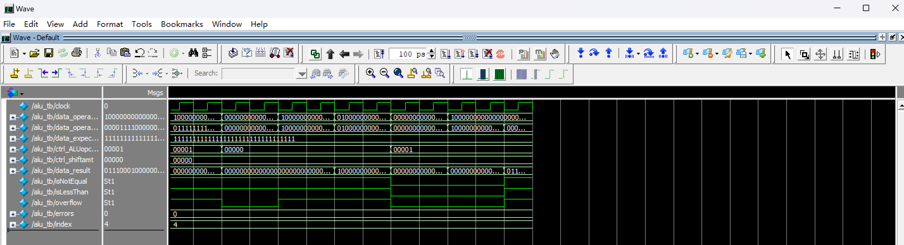

# PC3 - RegFile

## Introduction

Design and simulate a **register file** using Verilog. You must support:
- 2 read ports
- 1 write port
- 32 registers (registers are 32-bits wide)

### Module Interface

Your module must use the following interface (n.b. it is a template provided in regfile.v):

```verilog
module regfile(
    clock, ctrl_writeEnable, ctrl_reset, ctrl_writeReg,
    ctrl_readRegA, ctrl_readRegB, data_writeReg, 
    data_readRegA, data_readRegB
);

    input clock, ctrl_writeEnable, ctrl_reset;
    input [4:0] ctrl_writeReg, ctrl_readRegA, ctrl_readRegB;
    input [31:0] data_writeReg;

    output [31:0] data_readRegA, data_readRegB;

endmodule
```
### Background

A register file is a series of individual registers containing key information in a CPU. The register file allows for two essential actions: reading register values and writing values to registers. This is accomplished by **ports**. A **read port** takes in data from all of the registers in the register file and outputs only the data (in this case, `data_readRegA` or `data_readRegB`) from the desired register, as designated by control bits (`ctrl_readRegA`, `ctrl_readRegB`). A **write port** uses similar control bits (`ctrl_writeReg`) to determine which register to write data (`data_writeReg`) to.

Below is an example of a register file laid out in Logisim. Keep in mind that this example only contains 4 8-bit registers, while your module must contain 32 32-bit registers.

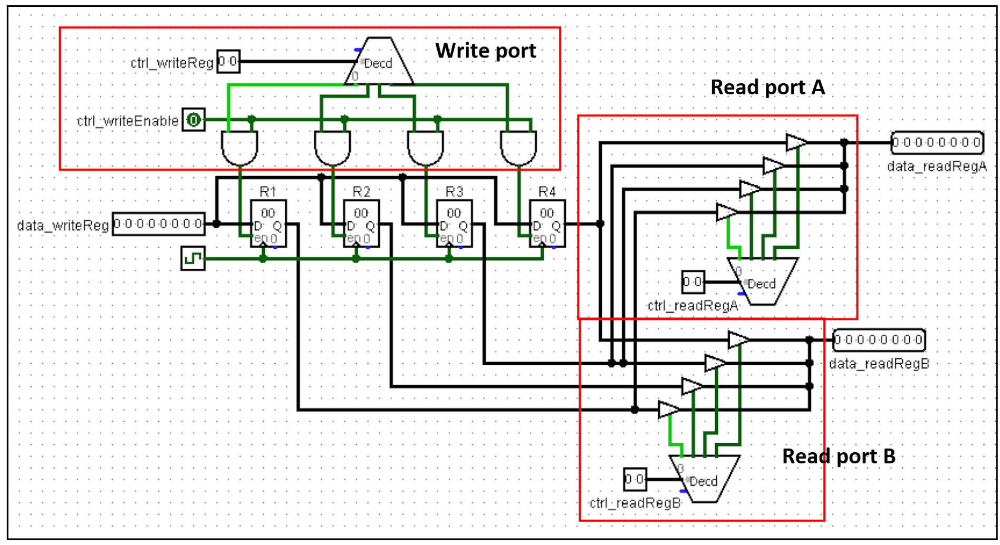

---

**Note:** the read ports above contain **tristate buffers**. These are common in read ports and can act as a faster mux (see the tristate buffer sections of [this article](#) for more information). The Verilog equivalent of such an element is:

```verilog
assign buffer_output = buffer_select ? output_if_true : 1’bz;
```

> This is a form of the ternary operator and **is allowed** in this project.

### Other Specifications:

- Your design must function with no longer than a 20ns clock period (i.e., it must be able to be clocked as fast as 50 MHz) 
- ==Register 0 must always read as 0 (no matter what is written to it, it will output 0)==
- You can use whatever you need to construct a DFFE （但是无论module名字是什么，文件名必须为dffe.v，否则通不过 Permitted Veilog Style Check (0/0)）

## My Design

### Structure:

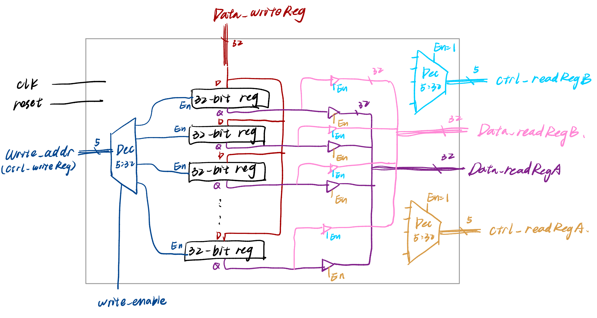

### RegFile

#### Design Idea:

The Register File structure is divided into 4 parts:

1. A register set of 32 32-bit registers: `Reg_sets`
2. A write port: `Write_port`
3. Two individual read ports: `Read_portA` and `Read_portB`
   - A register file typically needs two read ports because it is commonly used in processors to support **simultaneous reading of two source operands** in instructions that involve arithmetic or logic operations, such as addition, subtraction, multiplication, or comparisons.

```verilog
module regfile (
    clock,
    ctrl_writeEnable,
    ctrl_reset, ctrl_writeReg,
    ctrl_readRegA, ctrl_readRegB, data_writeReg,
    data_readRegA, data_readRegB
);

   input clock, ctrl_writeEnable, ctrl_reset;
   input [4:0] ctrl_writeReg, ctrl_readRegA, ctrl_readRegB;
   input [31:0] data_writeReg;

   output [31:0] data_readRegA, data_readRegB;

   /* YOUR CODE HERE */
	wire [1023:0] w_q;	// Q output of reg_sets_of_32 
	wire [31:0] w_dec;	// enabling output of dec_5to32
	
	w_port Write_port(.w_addr(ctrl_writeReg), .w_en(ctrl_writeEnable), .w_out(w_dec));
	reg_sets_of_32 Reg_sets(.D(data_writeReg), .clk(clock), .en(w_dec), .clr(ctrl_reset), .Q(w_q));
	
	r_port Read_portA(.r_in(w_q), .r_addr(ctrl_readRegA), .r_out(data_readRegA));
	r_port Read_portB(.r_in(w_q), .r_addr(ctrl_readRegB), .r_out(data_readRegB));

endmodule
```

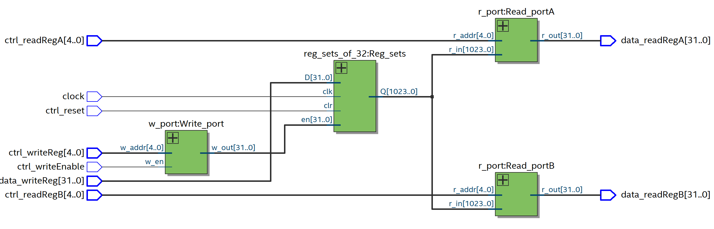

### Reg_sets

#### Design Idea:

`Reg_sets` is A register sets of 32 32-bit registers: 

- they share the same clear signal `clr` and clock signal `clk`
- each 32-bit register has its own enabling signal `en[i]`  and its own 32-bit output `Q[32*i +: 32]`
  - verilog doesn’t support 2-dimensional input, so 1024-bit output is used as the expansion of 32 * 32-bit ouput `Q`.
- Register 0 is always `32'b0` regardless of the writing data. Register 1~31 shared the writing data as their `D` input.

```verilog
module reg_sets_of_32(D, clk, en, clr, Q);
	input [31:0] D, en;
	input clk, clr;
	output [1023:0] Q;
	
	// Register 0 must always read as 0 (no matter what is written to it, it will output 0)
	reg_32bits reg32_inst0 (
				.d(32'b0),
				.clk(clk),
				.en(en[0]),
				.clr(clr),
				.q(Q[31:0])
				);
				
	genvar i;
	generate 
		for (i = 1; i < 32; i = i + 1) begin : reg_sets
			reg_32bits reg32_inst (
				.d(D),
				.clk(clk),
				.en(en[i]),
				.clr(clr),
				.q(Q[i*32 +: 32])
			);
		end
	endgenerate
	
endmodule
```

#### reg_32bits

To create a 32-bit register consisting of 32 `dffe_with_clear` modules in parallel, with all bits sharing the same enable and clear signals.

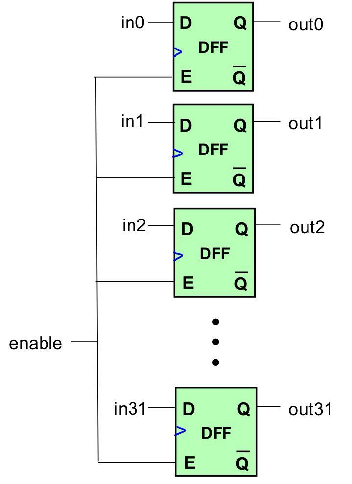

```verilog
module reg_32bits(d, clk, en, clr, q);
	input [31:0] d;
	input clk, en, clr;
	output [31:0] q;
	
	genvar i;
	generate 
		for (i = 0; i < 32; i = i + 1) begin : reg_32_parallel
			dffe_with_clr dffe_inst (
				.d(d[i]),
				.clk(clk),
				.en(en),
				.clr(clr),
				.q(q[i])
			);
		end
	endgenerate
endmodule
```

#### dffe.v

> In Quartus, `dffe` (D flip-flop with enable, no clear) is a reserved element. So we have to name our dffe in another way.
>
> 由于只有dffe可以用任何代码，因此无论module名是什么，文件名必须为dffe.v，否则无法通过 Permitted Veilog Style Check。

```verilog
module dffe_with_clr(d, clk, en, clr, q);
   
   //Inputs
   input d, clk, en, clr;
   
   //Output
   output reg q;

   //Intialize q to 0
   initial
   begin
       q = 1'b0;
   end

   //Set value of q on positive edge of the clock or clear
   always @(posedge clk or posedge clr) begin
       //If clear is high, set q to 0
       if (clr)
           q <= 1'b0;
       //If enable is high, set q to the value of d
       else if (en)
           q <= d;
   end
endmodule
```

### w_port

The write port contains a 5to32 decoder which takes the write address (which is the address of the register to write to) as the input and enables 1 out of 32 32-bit registers  (which is the specific register to write to). The write_enable is implemented as the enabling signal of the decoder.

```verilog
module w_port(w_addr, w_en, w_out);
	input [4:0] w_addr;
	input w_en;
	output [31:0] w_out;
	
	dec_5to32 w_dec(.in(w_addr), .en(w_en), .out(w_out));
	
endmodule
```

#### dec_5to32

As behavioral verilog is not allowed, the combinational logic (truth table method) is used to implement the decoder.

This decoder also has a enable input, which will be used for write enable. (If enable = 0, all output = 0, which means enabling 0 out of 32 32-bit registers.)

```verilog
module dec_5to32(in, en, out);
	input [4:0] in;
	input en;
	output [31:0] out;
	
	wire [4:0] not_in;

	not(not_in[0], in[0]);
	not(not_in[1], in[1]);
	not(not_in[2], in[2]);
	not(not_in[3], in[3]);
	not(not_in[4], in[4]);

	and(out[0], not_in[4], not_in[3], not_in[2], not_in[1], not_in[0], en);
	and(out[1], not_in[4], not_in[3], not_in[2], not_in[1], in[0], en);
	and(out[2], not_in[4], not_in[3], not_in[2], in[1], not_in[0], en);
	and(out[3], not_in[4], not_in[3], not_in[2], in[1], in[0], en);
	and(out[4], not_in[4], not_in[3], in[2], not_in[1], not_in[0], en);
	and(out[5], not_in[4], not_in[3], in[2], not_in[1], in[0], en);
	and(out[6], not_in[4], not_in[3], in[2], in[1], not_in[0], en);
	and(out[7], not_in[4], not_in[3], in[2], in[1], in[0], en);
	and(out[8], not_in[4], in[3], not_in[2], not_in[1], not_in[0], en);
	and(out[9], not_in[4], in[3], not_in[2], not_in[1], in[0], en);
	and(out[10], not_in[4], in[3], not_in[2], in[1], not_in[0], en);
	and(out[11], not_in[4], in[3], not_in[2], in[1], in[0], en);
	and(out[12], not_in[4], in[3], in[2], not_in[1], not_in[0], en);
	and(out[13], not_in[4], in[3], in[2], not_in[1], in[0], en);
	and(out[14], not_in[4], in[3], in[2], in[1], not_in[0], en);
	and(out[15], not_in[4], in[3], in[2], in[1], in[0], en);
	and(out[16], in[4], not_in[3], not_in[2], not_in[1], not_in[0], en);
	and(out[17], in[4], not_in[3], not_in[2], not_in[1], in[0], en);
	and(out[18], in[4], not_in[3], not_in[2], in[1], not_in[0], en);
	and(out[19], in[4], not_in[3], not_in[2], in[1], in[0], en);
	and(out[20], in[4], not_in[3], in[2], not_in[1], not_in[0], en);
	and(out[21], in[4], not_in[3], in[2], not_in[1], in[0], en);
	and(out[22], in[4], not_in[3], in[2], in[1], not_in[0], en);
	and(out[23], in[4], not_in[3], in[2], in[1], in[0], en);
	and(out[24], in[4], in[3], not_in[2], not_in[1], not_in[0], en);
	and(out[25], in[4], in[3], not_in[2], not_in[1], in[0], en);
	and(out[26], in[4], in[3], not_in[2], in[1], not_in[0], en);
	and(out[27], in[4], in[3], not_in[2], in[1], in[0], en);
	and(out[28], in[4], in[3], in[2], not_in[1], not_in[0], en);
	and(out[29], in[4], in[3], in[2], not_in[1], in[0], en);
	and(out[30], in[4], in[3], in[2], in[1], not_in[0], en);
	and(out[31], in[4], in[3], in[2], in[1], in[0], en);
	
endmodule
```

> verilog 支持 and() 多于两个的输入。

### r_port

The read port takes all 32 32-bit registers’ output as the input, and select one as output according to read address (which is the address of the register to read from).

Theoretically, we can use a Mux in the read port to select one out of many. However, mux is complicated in hardware and has poor performance. Here, 32 32-bit tristate-buffer is connected to each 32bit input wire, and by using the decoder to ensure that only one tristate buffer is enabled at a time, allowing the selected register's output to drive the shared output bus, while all other buffers remain in a high-impedance state (`z`). This reduces the hardware complexity and improves performance compared to using a large multiplexer.

```verilog
module r_port(r_in, r_addr, r_out);
	input [1023:0] r_in;
	input [4:0] r_addr;
	output [31:0] r_out;
	
	wire [31:0] tristate_en;
   
	// 5-to-32 decoder to generate enable signals
	dec_5to32 w_dec(.in(r_addr), .en(1'b1), .out(tristate_en));
	
	// Generate 32 tristate buffers in parallel
	genvar i;
	generate 
		for(i = 0; i < 32; i = i + 1) begin: _32_tristate_parallel
			tristate_buffer_32 trib32_inst (
				.in(r_in[i*32 +: 32]),	// start from i*32 th bit, expand 32bits
				.en(tristate_en[i]),
				.out(r_out)
			);
		end
	endgenerate

endmodule
```

#### tristate-buffer

```verilog
module tristate_buffer_32(in, en, out);
	input [31:0] in;
	input en;
	output [31:0] out;
	
	assign out = en ? in : 32'bz;	// z: high-resistance
endmodule
```

## TestBench

##### regfile_tb.v:

```verilog
// ---------- SAMPLE TEST BENCH ----------
`timescale 1 ns / 100 ps
module regfile_tb();
    // inputs to the DUT are reg type
    reg           clock, ctrl_writeEn, ctrl_reset;
    reg [4:0]     ctrl_writeReg, ctrl_readRegA, ctrl_readRegB;
    reg [31:0]    data_writeReg;

    // outputs from the DUT are wire type
    wire [31:0] data_readRegA, data_readRegB;

    // Tracking the number of errors
    integer errors;
    integer index;    // for testing...

    // instantiate the DUT
    regfile regfile_ut (clock, ctrl_writeEn, ctrl_reset, ctrl_writeReg,
        ctrl_readRegA, ctrl_readRegB, data_writeReg, data_readRegA, data_readRegB);

    // setting the initial values of all the reg
    initial
    begin
        $display($time, " << Starting the Simulation >>");
        clock = 1'b0;    // at time 0
        errors = 0;

        ctrl_reset = 1'b1;    // assert reset
        @(negedge clock);    // wait until next negative edge of clock
        @(negedge clock);    // wait until next negative edge of clock

        ctrl_reset = 1'b0;    // de-assert reset
        @(negedge clock);    // wait until next negative edge of clock

        // Begin testing... (loop over registers)
        for(index = 0; index <= 31; index = index + 1) begin
            writeRegister(index, 32'h0000DEAD);
            checkRegister(index, 32'h0000DEAD);
        end

        if (errors == 0) begin
            $display("The simulation completed without errors");
        end
        else begin
            $display("The simulation failed with %d errors", errors);
        end

        $stop;
    end


    // Clock generator
    always
         #10     clock = ~clock;    // toggle

    // Task for writing
    task writeRegister;

        input [4:0] writeReg;
        input [31:0] value;

        begin
            @(negedge clock);    // wait for next negedge of clock
            $display($time, " << Writing register %d with %h >>", writeReg, value);

            ctrl_writeEn = 1'b1;
            ctrl_writeReg = writeReg;
            data_writeReg = value;

            @(negedge clock); // wait for next negedge, write should be done
            ctrl_writeEn = 1'b0;
        end
    endtask

    // Task for reading
    task checkRegister;

        input [4:0] checkReg;
        input [31:0] exp;

        begin
            @(negedge clock);    // wait for next negedge of clock

            ctrl_readRegA = checkReg;    // test port A
            ctrl_readRegB = checkReg;    // test port B

            @(negedge clock); // wait for next negedge, read should be done

            if(data_readRegA !== ((checkReg == 5'b0) ? 32'b0 : exp)) begin
                $display("**Error on port A: read %h but expected %h.", data_readRegA, 32'b0);
                errors = errors + 1;
            end

            if(data_readRegB !== ((checkReg == 5'b0) ? 32'b0 : exp)) begin
                $display("**Error on port B: read %h but expected %h.", data_readRegB, 32'b0);
                errors = errors + 1;
            end
        end
    endtask
endmodule
```

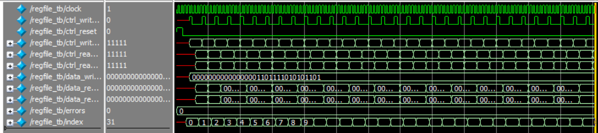


# PC4 - Simple Processor

## Introduction:

In this and the next checkpoints, you will design and simulate a single-cycle 32-bit processor, using Verilog. A skeleton has been built for you, including many of the essential components that make up the CPU. This skeleton module includes the top-level entity (“skeleton”), processor (“processor”), data memory (“dmem”), instruction memory (“imem”), and regfile (“regfile”).

Your task is to generate the processor module. Please make sure that your design:

- Integrates your register file and ALU units
- Properly generates the dmem and imem files by generating Quartus syncram components

For this checkpoint, you are required to implement some basic functionalities of a processor. Specifically, ==you will implement the following R-type and I-type instructions==: `add`, `addi`, `sub`, `and`, `or`, `sll`, `sra`, `sw`, and `lw`. **DO NOT** implement J-type (and other I-type) instructions in this checkpoint. In the next checkpoint, you will add other instructions to be supported by your processor.

------

### Module Interface

**Designs that do not adhere to the following specification will incur significant penalties.**

Please follow the provided basecode in the cpuone-base directory. Do not make any modifications to the interface of processor or regfile. The basecode includes a skeleton file that serves as a wrapper around your code. **The skeleton is the top-level module and it allows for integrating all of your required components together.** Please make sure your code compiles with the skeleton set as the top-level entity before submission.

------

### Other Specifications

**Designs that do not adhere to the following specifications will incur significant penalties.**

Your design must operate correctly with a **50 MHz clock**. You may use clock dividers ([see this link](https://www.example.com)) as needed for your processor to function correctly. Also, in the setup of your project in Quartus, make sure to pick the correct device (designated in Recitation 1).

1. **Memory rules:**
   - ==Memory is word-addressed (32-bits per read/write)==
   - Instruction (imem) and data memory (dmem) are separate
   - Static data begins at data memory address 0
   - Stack data begins at data memory address 2^16-1 and grows downward
   - ==由提供的文件可以进一步得到 imem 和 dmem 的大小均为 2^12 words. (`address_imem` 和 `address_dmem` 均为 12 bits)==
2. **After a reset**, all register values should be 0 and program execution begins from instruction memory address 0. Instruction and data memories are not reset.

------

### Register Naming

We use two conventions for naming registers:

- `$i` or `$ri`, e.g., `$r23` or `$23`; this refers to the same register, i.e., register 23.

------

### Special Registers

- `$r0` should always be zero.

  - *Protip*: make sure your bypass logic handles this.

- `$r30` is the status register, also called `$rstatus`

  - It may be set and overwritten like a normal register; however, as indicated in the ISA, it can also be set when certain exceptions occur.
  - **Exceptions take precedent** when writing to `$r30`.

- `$r31` or `$ra`: is the return address register, used during a `jal`

   instruction.

  - It may also be set and overwritten like a normal register.

### ISA:

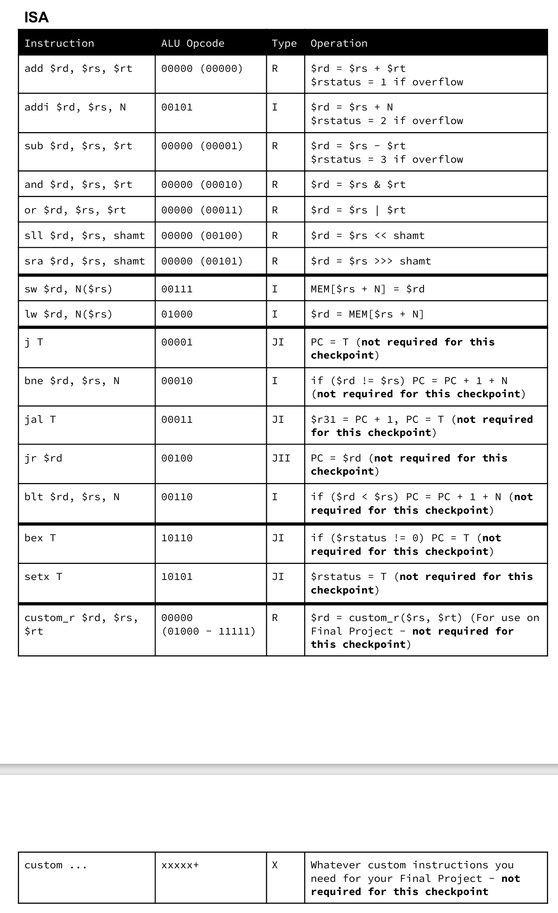

### Instruction Machine Code Format:

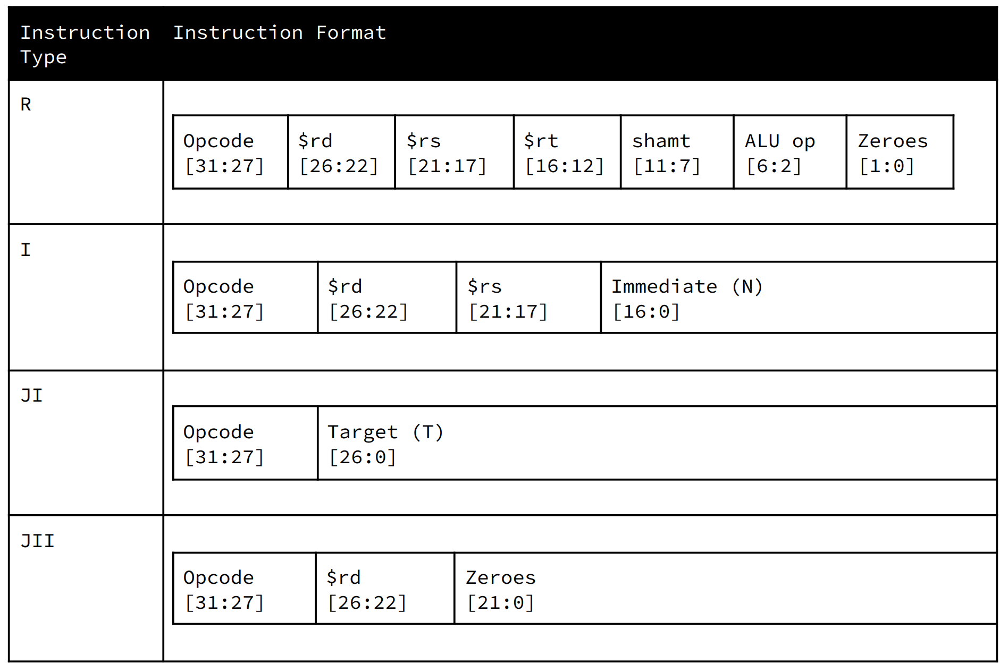

## My Design:

### clk_divn:

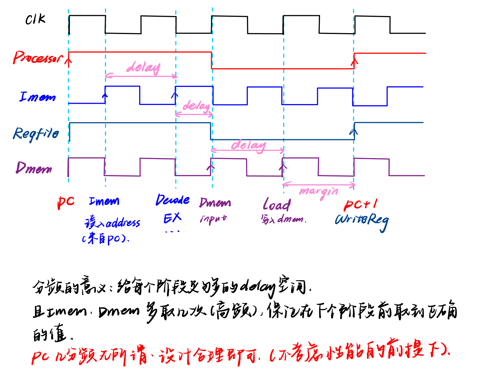

> Processor and Regfile clk are divided by 4 (of clk’s frequency) in the illustration.
>
> In this design: 
>
> - `clk_divn.v`: Divides the main clock (`clk`) by 5, used as the clock input for `processor_clock` and `regfile_clock`.
> - `imem_clock` and `dmem_clock` has the same frequency as `clk`, where `imem_clock` is inverted `clk`.

```verilog
module clk_divn #(
parameter WIDTH = 3,
parameter N = 5)
 
(clk, reset, clk_out);
 
input clk;
input reset;
output clk_out;
 
reg [WIDTH - 1 : 0] pos_count, neg_count;
wire [WIDTH - 1 : 0] r_nxt;
 
always @(posedge clk)
	if (reset)
		pos_count <= 0;
	else if (pos_count == N - 1) pos_count <= 0;
	else pos_count<= pos_count + 1;

always @(negedge clk)
	if (reset)
		neg_count <= 0;
	else  if (neg_count == N - 1) neg_count <= 0;
	else neg_count<= neg_count + 1; 

assign clk_out = ((pos_count > (N >> 1)) | (neg_count > (N >> 1))); 
endmodule
```

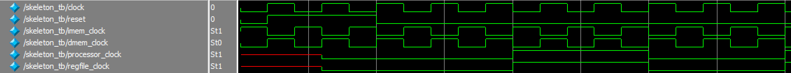

### Structure:

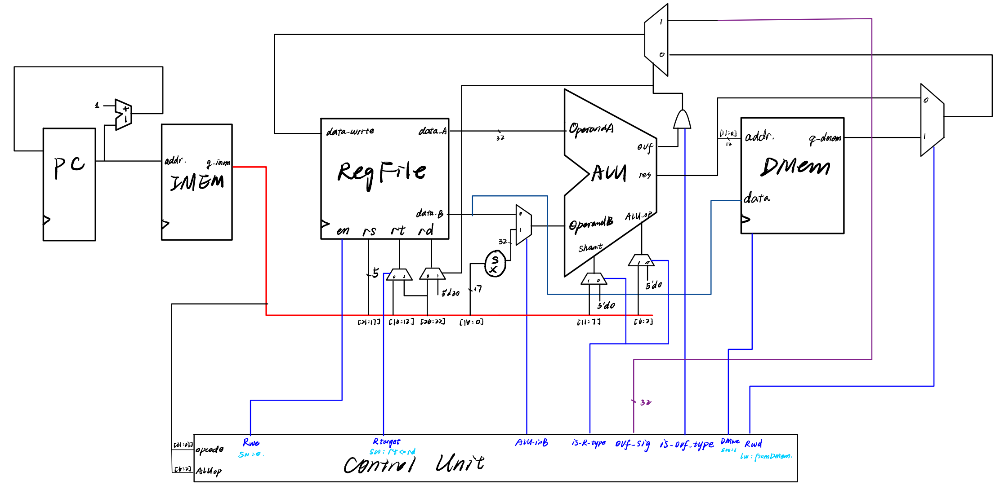

### skeleton:

- used to connect regfile, imem, dmem and processor

```verilog
/**
 * NOTE: you should not need to change this file! This file will be swapped out for a grading
 * "skeleton" for testing. We will also remove your imem and dmem file.
 *
 * NOTE: skeleton should be your top-level module!
 *
 * This skeleton file serves as a wrapper around the processor to provide certain control signals
 * and interfaces to memory elements. This structure allows for easier testing, as it is easier to
 * inspect which signals the processor tries to assert when.
 */

module skeleton(clock, reset, imem_clock, dmem_clock, processor_clock, regfile_clock);
    input clock, reset;
    /* 
        Create four clocks for each module from the original input "clock".
        These four outputs will be used to run the clocked elements of your processor on the grading side. 
        You should output the clocks you have decided to use for the imem, dmem, regfile, and processor 
        (these may be inverted, divided, or unchanged from the original clock input). Your grade will be 
        based on proper functioning with this clock.
    */
    output imem_clock, dmem_clock, processor_clock, regfile_clock;
	 
	 assign imem_clock = ~clock;
	 assign dmem_clock = clock;
	 clk_divn processor_div(clock,reset,processor_clock);
	 clk_divn regfile_div(clock,reset,regfile_clock);
	 
    /** IMEM **/
    // Figure out how to generate a Quartus syncram component and commit the generated verilog file.
    // Make sure you configure it correctly!
    wire [11:0] address_imem;
    wire [31:0] q_imem;
    imem my_imem(
        .address    (address_imem),            // address of data
        .clock      (imem_clock),                  // you may need to invert the clock
        .q          (q_imem)                   // the raw instruction
    );

    /** DMEM **/
    // Figure out how to generate a Quartus syncram component and commit the generated verilog file.
    // Make sure you configure it correctly!
    wire [11:0] address_dmem;
    wire [31:0] data;
    wire wren;
    wire [31:0] q_dmem;
    dmem my_dmem(
        .address    (address_dmem),       // address of data
        .clock      (dmem_clock),                  // may need to invert the clock
        .data	    (data),    // data you want to write
        .wren	    (wren),      // write enable
        .q          (q_dmem)    // data from dmem
    );

    /** REGFILE **/
    // Instantiate your regfile
    wire ctrl_writeEnable;
    wire [4:0] ctrl_writeReg, ctrl_readRegA, ctrl_readRegB;
    wire [31:0] data_writeReg;
    wire [31:0] data_readRegA, data_readRegB;
    regfile my_regfile(
        regfile_clock,
        ctrl_writeEnable,
        reset,
        ctrl_writeReg,
        ctrl_readRegA,
        ctrl_readRegB,
        data_writeReg,
        data_readRegA,
        data_readRegB
    );

    /** PROCESSOR **/
    processor my_processor(
        // Control signals
        processor_clock,                          // I: The master clock
        reset,                          // I: A reset signal

        // Imem
        address_imem,                   // O: The address of the data to get from imem
        q_imem,                         // I: The data from imem

        // Dmem
        address_dmem,                   // O: The address of the data to get or put from/to dmem
        data,                           // O: The data to write to dmem
        wren,                           // O: Write enable for dmem
        q_dmem,                         // I: The data from dmem

        // Regfile
        ctrl_writeEnable,               // O: Write enable for regfile
        ctrl_writeReg,                  // O: Register to write to in regfile
        ctrl_readRegA,                  // O: Register to read from port A of regfile
        ctrl_readRegB,                  // O: Register to read from port B of regfile
        data_writeReg,                  // O: Data to write to for regfile
        data_readRegA,                  // I: Data from port A of regfile
        data_readRegB                   // I: Data from port B of regfile
    );

endmodule
```

#### RegFile:

> $0 is always 0

```verilog
module regfile(
	clock, ctrl_writeEnable, ctrl_reset, ctrl_writeReg,
	ctrl_readRegA, ctrl_readRegB, data_writeReg, data_readRegA,
	data_readRegB
);
	input clock, ctrl_writeEnable, ctrl_reset;
	input [4:0] ctrl_writeReg, ctrl_readRegA, ctrl_readRegB;
	input [31:0] data_writeReg;
	output [31:0] data_readRegA, data_readRegB;

	reg[31:0] registers[31:0];
	
	integer i;
	
	always @(posedge clock or posedge ctrl_reset)
	begin
		if(ctrl_reset)
			begin
				for(i = 0; i < 32; i = i + 1)
					begin
						registers[i] = 32'd0;
					end
			end
		else
			if(ctrl_writeEnable && ctrl_writeReg != 5'd0)
				registers[ctrl_writeReg] = data_writeReg;
	end
	
	assign data_readRegA = registers[ctrl_readRegA];
	assign data_readRegB = registers[ctrl_readRegB];
	
endmodule
```

#### imem:

- implemented by IP Catalog - ROM: 1-PORT
- memory unit size: **32** bits
- memory size: 2^**12** = 4096 units

```verilog
// megafunction wizard: %ROM: 1-PORT%
// GENERATION: STANDARD
// VERSION: WM1.0
// MODULE: altsyncram 

// ============================================================
// File Name: imem.v
// Megafunction Name(s):
// 			altsyncram
//
// Simulation Library Files(s):
// 			altera_mf
// ============================================================
// ************************************************************
// THIS IS A WIZARD-GENERATED FILE. DO NOT EDIT THIS FILE!
//
// 17.0.0 Build 595 04/25/2017 SJ Lite Edition
// ************************************************************


//Copyright (C) 2017  Intel Corporation. All rights reserved.
//Your use of Intel Corporation's design tools, logic functions 
//and other software and tools, and its AMPP partner logic 
//functions, and any output files from any of the foregoing 
//(including device programming or simulation files), and any 
//associated documentation or information are expressly subject 
//to the terms and conditions of the Intel Program License 
//Subscription Agreement, the Intel Quartus Prime License Agreement,
//the Intel MegaCore Function License Agreement, or other 
//applicable license agreement, including, without limitation, 
//that your use is for the sole purpose of programming logic 
//devices manufactured by Intel and sold by Intel or its 
//authorized distributors.  Please refer to the applicable 
//agreement for further details.


// synopsys translate_off
`timescale 1 ps / 1 ps
// synopsys translate_on
module imem (
	address,
	clock,
	q);

	input	[11:0]  address;
	input	  clock;
	output	[31:0]  q;
`ifndef ALTERA_RESERVED_QIS
// synopsys translate_off
`endif
	tri1	  clock;
`ifndef ALTERA_RESERVED_QIS
// synopsys translate_on
`endif

	wire [31:0] sub_wire0;
	wire [31:0] q = sub_wire0[31:0];

	altsyncram	altsyncram_component (
				.address_a (address),
				.clock0 (clock),
				.q_a (sub_wire0),
				.aclr0 (1'b0),
				.aclr1 (1'b0),
				.address_b (1'b1),
				.addressstall_a (1'b0),
				.addressstall_b (1'b0),
				.byteena_a (1'b1),
				.byteena_b (1'b1),
				.clock1 (1'b1),
				.clocken0 (1'b1),
				.clocken1 (1'b1),
				.clocken2 (1'b1),
				.clocken3 (1'b1),
				.data_a ({32{1'b1}}),
				.data_b (1'b1),
				.eccstatus (),
				.q_b (),
				.rden_a (1'b1),
				.rden_b (1'b1),
				.wren_a (1'b0),
				.wren_b (1'b0));
	defparam
		altsyncram_component.address_aclr_a = "NONE",
		altsyncram_component.clock_enable_input_a = "BYPASS",
		altsyncram_component.clock_enable_output_a = "BYPASS",
		altsyncram_component.init_file = "halfTestCasesOverflow.mif",
		altsyncram_component.intended_device_family = "Cyclone IV E",
		altsyncram_component.lpm_hint = "ENABLE_RUNTIME_MOD=NO",
		altsyncram_component.lpm_type = "altsyncram",
		altsyncram_component.numwords_a = 4096,
		altsyncram_component.operation_mode = "ROM",
		altsyncram_component.outdata_aclr_a = "NONE",
		altsyncram_component.outdata_reg_a = "CLOCK0",
		altsyncram_component.widthad_a = 12,
		altsyncram_component.width_a = 32,
		altsyncram_component.width_byteena_a = 1;


endmodule

// ============================================================
// CNX file retrieval info
// ============================================================
// Retrieval info: PRIVATE: ADDRESSSTALL_A NUMERIC "0"
// Retrieval info: PRIVATE: AclrAddr NUMERIC "0"
// Retrieval info: PRIVATE: AclrByte NUMERIC "0"
// Retrieval info: PRIVATE: AclrOutput NUMERIC "0"
// Retrieval info: PRIVATE: BYTE_ENABLE NUMERIC "0"
// Retrieval info: PRIVATE: BYTE_SIZE NUMERIC "8"
// Retrieval info: PRIVATE: BlankMemory NUMERIC "0"
// Retrieval info: PRIVATE: CLOCK_ENABLE_INPUT_A NUMERIC "0"
// Retrieval info: PRIVATE: CLOCK_ENABLE_OUTPUT_A NUMERIC "0"
// Retrieval info: PRIVATE: Clken NUMERIC "0"
// Retrieval info: PRIVATE: IMPLEMENT_IN_LES NUMERIC "0"
// Retrieval info: PRIVATE: INIT_FILE_LAYOUT STRING "PORT_A"
// Retrieval info: PRIVATE: INIT_TO_SIM_X NUMERIC "0"
// Retrieval info: PRIVATE: INTENDED_DEVICE_FAMILY STRING "Cyclone IV E"
// Retrieval info: PRIVATE: JTAG_ENABLED NUMERIC "0"
// Retrieval info: PRIVATE: JTAG_ID STRING "NONE"
// Retrieval info: PRIVATE: MAXIMUM_DEPTH NUMERIC "0"
// Retrieval info: PRIVATE: MIFfilename STRING "halfTestCases.mif"
// Retrieval info: PRIVATE: NUMWORDS_A NUMERIC "4096"
// Retrieval info: PRIVATE: RAM_BLOCK_TYPE NUMERIC "0"
// Retrieval info: PRIVATE: RegAddr NUMERIC "1"
// Retrieval info: PRIVATE: RegOutput NUMERIC "1"
// Retrieval info: PRIVATE: SYNTH_WRAPPER_GEN_POSTFIX STRING "0"
// Retrieval info: PRIVATE: SingleClock NUMERIC "1"
// Retrieval info: PRIVATE: UseDQRAM NUMERIC "0"
// Retrieval info: PRIVATE: WidthAddr NUMERIC "12"
// Retrieval info: PRIVATE: WidthData NUMERIC "32"
// Retrieval info: PRIVATE: rden NUMERIC "0"
// Retrieval info: LIBRARY: altera_mf altera_mf.altera_mf_components.all
// Retrieval info: CONSTANT: ADDRESS_ACLR_A STRING "NONE"
// Retrieval info: CONSTANT: CLOCK_ENABLE_INPUT_A STRING "BYPASS"
// Retrieval info: CONSTANT: CLOCK_ENABLE_OUTPUT_A STRING "BYPASS"
// Retrieval info: CONSTANT: INIT_FILE STRING "halfTestCases.mif"
// Retrieval info: CONSTANT: INTENDED_DEVICE_FAMILY STRING "Cyclone IV E"
// Retrieval info: CONSTANT: LPM_HINT STRING "ENABLE_RUNTIME_MOD=NO"
// Retrieval info: CONSTANT: LPM_TYPE STRING "altsyncram"
// Retrieval info: CONSTANT: NUMWORDS_A NUMERIC "4096"
// Retrieval info: CONSTANT: OPERATION_MODE STRING "ROM"
// Retrieval info: CONSTANT: OUTDATA_ACLR_A STRING "NONE"
// Retrieval info: CONSTANT: OUTDATA_REG_A STRING "CLOCK0"
// Retrieval info: CONSTANT: WIDTHAD_A NUMERIC "12"
// Retrieval info: CONSTANT: WIDTH_A NUMERIC "32"
// Retrieval info: CONSTANT: WIDTH_BYTEENA_A NUMERIC "1"
// Retrieval info: USED_PORT: address 0 0 12 0 INPUT NODEFVAL "address[11..0]"
// Retrieval info: USED_PORT: clock 0 0 0 0 INPUT VCC "clock"
// Retrieval info: USED_PORT: q 0 0 32 0 OUTPUT NODEFVAL "q[31..0]"
// Retrieval info: CONNECT: @address_a 0 0 12 0 address 0 0 12 0
// Retrieval info: CONNECT: @clock0 0 0 0 0 clock 0 0 0 0
// Retrieval info: CONNECT: q 0 0 32 0 @q_a 0 0 32 0
// Retrieval info: GEN_FILE: TYPE_NORMAL imem.v TRUE
// Retrieval info: GEN_FILE: TYPE_NORMAL imem.inc FALSE
// Retrieval info: GEN_FILE: TYPE_NORMAL imem.cmp FALSE
// Retrieval info: GEN_FILE: TYPE_NORMAL imem.bsf FALSE
// Retrieval info: GEN_FILE: TYPE_NORMAL imem_inst.v FALSE
// Retrieval info: GEN_FILE: TYPE_NORMAL imem_bb.v TRUE
// Retrieval info: LIB_FILE: altera_mf
```

#### dmem:

- implemented by IP Catalog - RAM: 1-PORT
- memory unit size: **32** bits
- memory size: 2^**12** = 4096 units

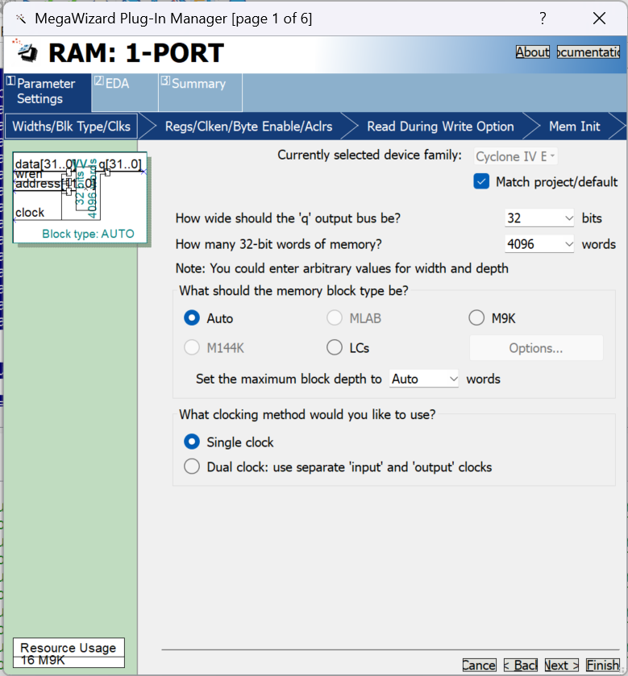

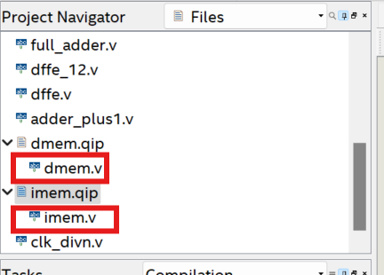

```verilog
// megafunction wizard: %RAM: 1-PORT%
// GENERATION: STANDARD
// VERSION: WM1.0
// MODULE: altsyncram 

// ============================================================
// File Name: dmem.v
// Megafunction Name(s):
// 			altsyncram
//
// Simulation Library Files(s):
// 			altera_mf
// ============================================================
// ************************************************************
// THIS IS A WIZARD-GENERATED FILE. DO NOT EDIT THIS FILE!
//
// 17.0.0 Build 595 04/25/2017 SJ Lite Edition
// ************************************************************


//Copyright (C) 2017  Intel Corporation. All rights reserved.
//Your use of Intel Corporation's design tools, logic functions 
//and other software and tools, and its AMPP partner logic 
//functions, and any output files from any of the foregoing 
//(including device programming or simulation files), and any 
//associated documentation or information are expressly subject 
//to the terms and conditions of the Intel Program License 
//Subscription Agreement, the Intel Quartus Prime License Agreement,
//the Intel MegaCore Function License Agreement, or other 
//applicable license agreement, including, without limitation, 
//that your use is for the sole purpose of programming logic 
//devices manufactured by Intel and sold by Intel or its 
//authorized distributors.  Please refer to the applicable 
//agreement for further details.


// synopsys translate_off
`timescale 1 ps / 1 ps
// synopsys translate_on
module dmem (
	address,
	clock,
	data,
	wren,
	q);

	input	[11:0]  address;
	input	  clock;
	input	[31:0]  data;
	input	  wren;
	output	[31:0]  q;
`ifndef ALTERA_RESERVED_QIS
// synopsys translate_off
`endif
	tri1	  clock;
`ifndef ALTERA_RESERVED_QIS
// synopsys translate_on
`endif

	wire [31:0] sub_wire0;
	wire [31:0] q = sub_wire0[31:0];

	altsyncram	altsyncram_component (
				.address_a (address),
				.clock0 (clock),
				.data_a (data),
				.wren_a (wren),
				.q_a (sub_wire0),
				.aclr0 (1'b0),
				.aclr1 (1'b0),
				.address_b (1'b1),
				.addressstall_a (1'b0),
				.addressstall_b (1'b0),
				.byteena_a (1'b1),
				.byteena_b (1'b1),
				.clock1 (1'b1),
				.clocken0 (1'b1),
				.clocken1 (1'b1),
				.clocken2 (1'b1),
				.clocken3 (1'b1),
				.data_b (1'b1),
				.eccstatus (),
				.q_b (),
				.rden_a (1'b1),
				.rden_b (1'b1),
				.wren_b (1'b0));
	defparam
		altsyncram_component.clock_enable_input_a = "BYPASS",
		altsyncram_component.clock_enable_output_a = "BYPASS",
		altsyncram_component.intended_device_family = "Cyclone IV E",
		altsyncram_component.lpm_hint = "ENABLE_RUNTIME_MOD=NO",
		altsyncram_component.lpm_type = "altsyncram",
		altsyncram_component.numwords_a = 4096,
		altsyncram_component.operation_mode = "SINGLE_PORT",
		altsyncram_component.outdata_aclr_a = "NONE",
		altsyncram_component.outdata_reg_a = "CLOCK0",
		altsyncram_component.power_up_uninitialized = "FALSE",
		altsyncram_component.read_during_write_mode_port_a = "NEW_DATA_NO_NBE_READ",
		altsyncram_component.widthad_a = 12,
		altsyncram_component.width_a = 32,
		altsyncram_component.width_byteena_a = 1;


endmodule

// ============================================================
// CNX file retrieval info
// ============================================================
// Retrieval info: PRIVATE: ADDRESSSTALL_A NUMERIC "0"
// Retrieval info: PRIVATE: AclrAddr NUMERIC "0"
// Retrieval info: PRIVATE: AclrByte NUMERIC "0"
// Retrieval info: PRIVATE: AclrData NUMERIC "0"
// Retrieval info: PRIVATE: AclrOutput NUMERIC "0"
// Retrieval info: PRIVATE: BYTE_ENABLE NUMERIC "0"
// Retrieval info: PRIVATE: BYTE_SIZE NUMERIC "8"
// Retrieval info: PRIVATE: BlankMemory NUMERIC "1"
// Retrieval info: PRIVATE: CLOCK_ENABLE_INPUT_A NUMERIC "0"
// Retrieval info: PRIVATE: CLOCK_ENABLE_OUTPUT_A NUMERIC "0"
// Retrieval info: PRIVATE: Clken NUMERIC "0"
// Retrieval info: PRIVATE: DataBusSeparated NUMERIC "1"
// Retrieval info: PRIVATE: IMPLEMENT_IN_LES NUMERIC "0"
// Retrieval info: PRIVATE: INIT_FILE_LAYOUT STRING "PORT_A"
// Retrieval info: PRIVATE: INIT_TO_SIM_X NUMERIC "0"
// Retrieval info: PRIVATE: INTENDED_DEVICE_FAMILY STRING "Cyclone IV E"
// Retrieval info: PRIVATE: JTAG_ENABLED NUMERIC "0"
// Retrieval info: PRIVATE: JTAG_ID STRING "NONE"
// Retrieval info: PRIVATE: MAXIMUM_DEPTH NUMERIC "0"
// Retrieval info: PRIVATE: MIFfilename STRING ""
// Retrieval info: PRIVATE: NUMWORDS_A NUMERIC "4096"
// Retrieval info: PRIVATE: RAM_BLOCK_TYPE NUMERIC "0"
// Retrieval info: PRIVATE: READ_DURING_WRITE_MODE_PORT_A NUMERIC "3"
// Retrieval info: PRIVATE: RegAddr NUMERIC "1"
// Retrieval info: PRIVATE: RegData NUMERIC "1"
// Retrieval info: PRIVATE: RegOutput NUMERIC "1"
// Retrieval info: PRIVATE: SYNTH_WRAPPER_GEN_POSTFIX STRING "0"
// Retrieval info: PRIVATE: SingleClock NUMERIC "1"
// Retrieval info: PRIVATE: UseDQRAM NUMERIC "1"
// Retrieval info: PRIVATE: WRCONTROL_ACLR_A NUMERIC "0"
// Retrieval info: PRIVATE: WidthAddr NUMERIC "12"
// Retrieval info: PRIVATE: WidthData NUMERIC "32"
// Retrieval info: PRIVATE: rden NUMERIC "0"
// Retrieval info: LIBRARY: altera_mf altera_mf.altera_mf_components.all
// Retrieval info: CONSTANT: CLOCK_ENABLE_INPUT_A STRING "BYPASS"
// Retrieval info: CONSTANT: CLOCK_ENABLE_OUTPUT_A STRING "BYPASS"
// Retrieval info: CONSTANT: INTENDED_DEVICE_FAMILY STRING "Cyclone IV E"
// Retrieval info: CONSTANT: LPM_HINT STRING "ENABLE_RUNTIME_MOD=NO"
// Retrieval info: CONSTANT: LPM_TYPE STRING "altsyncram"
// Retrieval info: CONSTANT: NUMWORDS_A NUMERIC "4096"
// Retrieval info: CONSTANT: OPERATION_MODE STRING "SINGLE_PORT"
// Retrieval info: CONSTANT: OUTDATA_ACLR_A STRING "NONE"
// Retrieval info: CONSTANT: OUTDATA_REG_A STRING "CLOCK0"
// Retrieval info: CONSTANT: POWER_UP_UNINITIALIZED STRING "FALSE"
// Retrieval info: CONSTANT: READ_DURING_WRITE_MODE_PORT_A STRING "NEW_DATA_NO_NBE_READ"
// Retrieval info: CONSTANT: WIDTHAD_A NUMERIC "12"
// Retrieval info: CONSTANT: WIDTH_A NUMERIC "32"
// Retrieval info: CONSTANT: WIDTH_BYTEENA_A NUMERIC "1"
// Retrieval info: USED_PORT: address 0 0 12 0 INPUT NODEFVAL "address[11..0]"
// Retrieval info: USED_PORT: clock 0 0 0 0 INPUT VCC "clock"
// Retrieval info: USED_PORT: data 0 0 32 0 INPUT NODEFVAL "data[31..0]"
// Retrieval info: USED_PORT: q 0 0 32 0 OUTPUT NODEFVAL "q[31..0]"
// Retrieval info: USED_PORT: wren 0 0 0 0 INPUT NODEFVAL "wren"
// Retrieval info: CONNECT: @address_a 0 0 12 0 address 0 0 12 0
// Retrieval info: CONNECT: @clock0 0 0 0 0 clock 0 0 0 0
// Retrieval info: CONNECT: @data_a 0 0 32 0 data 0 0 32 0
// Retrieval info: CONNECT: @wren_a 0 0 0 0 wren 0 0 0 0
// Retrieval info: CONNECT: q 0 0 32 0 @q_a 0 0 32 0
// Retrieval info: GEN_FILE: TYPE_NORMAL dmem.v TRUE
// Retrieval info: GEN_FILE: TYPE_NORMAL dmem.inc FALSE
// Retrieval info: GEN_FILE: TYPE_NORMAL dmem.cmp FALSE
// Retrieval info: GEN_FILE: TYPE_NORMAL dmem.bsf FALSE
// Retrieval info: GEN_FILE: TYPE_NORMAL dmem_inst.v FALSE
// Retrieval info: GEN_FILE: TYPE_NORMAL dmem_bb.v TRUE
// Retrieval info: LIB_FILE: altera_mf
```

### Processor:

- The `processor` module represents a simple CPU design that interfaces with instruction memory (`Imem`), data memory (`Dmem`), and a register file (`Regfile`).
- The `processor` module simulates a simple CPU capable of fetching, decoding, and executing instructions. It manages control signals across multiple stages (fetch, decode, execute, memory access, and write-back) to simulate basic processor functionalities.

```verilog
/**
 * READ THIS DESCRIPTION!
 *
 * The processor takes in several inputs from a skeleton file.
 *
 * Inputs
 * clock: this is the clock for your processor at 50 MHz
 * reset: we should be able to assert a reset to start your pc from 0 (sync or
 * async is fine)
 *
 * Imem: input data from imem
 * Dmem: input data from dmem
 * Regfile: input data from regfile
 *
 * Outputs
 * Imem: output control signals to interface with imem
 * Dmem: output control signals and data to interface with dmem
 * Regfile: output control signals and data to interface with regfile
 *
 * Notes
 *
 * Ultimately, your processor will be tested by subsituting a master skeleton, imem, dmem, so the
 * testbench can see which controls signal you active when. Therefore, there needs to be a way to
 * "inject" imem, dmem, and regfile interfaces from some external controller module. The skeleton
 * file acts as a small wrapper around your processor for this purpose.
 *
 * You will need to figure out how to instantiate two memory elements, called
 * "syncram," in Quartus: one for imem and one for dmem. Each should take in a
 * 12-bit address and allow for storing a 32-bit value at each address. Each
 * should have a single clock.
 *
 * Each memory element should have a corresponding .mif file that initializes
 * the memory element to certain value on start up. These should be named
 * imem.mif and dmem.mif respectively.
 *
 * Importantly, these .mif files should be placed at the top level, i.e. there
 * should be an imem.mif and a dmem.mif at the same level as process.v. You
 * should figure out how to point your generated imem.v and dmem.v files at
 * these MIF files.
 *
 * imem
 * Inputs:  12-bit address, 1-bit clock enable, and a clock
 * Outputs: 32-bit instruction
 *
 * dmem
 * Inputs:  12-bit address, 1-bit clock, 32-bit data, 1-bit write enable
 * Outputs: 32-bit data at the given address
 *
 */
module processor(
    // Control signals
    clock,                          // I: The master clock
    reset,                          // I: A reset signal

    // Imem
    address_imem,                   // O: The address of the data to get from imem
    q_imem,                         // I: The data from imem

    // Dmem
    address_dmem,                   // O: The address of the data to get or put from/to dmem
    data,                           // O: The data to write to dmem
    wren,                           // O: Write enable for dmem
    q_dmem,                         // I: The data from dmem

    // Regfile
    ctrl_writeEnable,               // O: Write enable for regfile
    ctrl_writeReg,                  // O: Register to write to in regfile
    ctrl_readRegA,                  // O: Register to read from port A of regfile
    ctrl_readRegB,                  // O: Register to read from port B of regfile
    data_writeReg,                  // O: Data to write to for regfile
    data_readRegA,                  // I: Data from port A of regfile
    data_readRegB                   // I: Data from port B of regfile
);
    // Control signals
    input clock, reset;

    // Imem
    output [11:0] address_imem;
    input [31:0] q_imem;

    // Dmem
    output [11:0] address_dmem;
    output [31:0] data;
    output wren;	// DMen
    input [31:0] q_dmem;

    // Regfile
    output ctrl_writeEnable;	// Rwe
    output [4:0] ctrl_writeReg, ctrl_readRegA, ctrl_readRegB;
    output [31:0] data_writeReg;
    input [31:0] data_readRegA, data_readRegB;

    /* YOUR CODE STARTS HERE */
	 // wires
	 // PC
	 wire [11:0] pc_in, pc_out;
	 
	 // control unit
	 wire Rwe, Rtarget, ALUinB, DMwe, Rwd, is_R_type, is_ovf_type;
	 wire [31:0] ovf_sig;
	 wire ovf_ctrl;	// ovf && is_ovf_type
	 
	 // RegFile
	 wire [4:0] rd, rt;
	 
	 // ALU
	 wire overflow, isLessThan, isNotEqual;
	 wire [31:0] data_operandA, data_operandB, data_result;
	 wire [31:0] extend_immed;
	 wire [4:0] shamt, ALUop;
	 
	 // connection
	 // PC
	 adder_plus1 pc_incrementer(.in(pc_out), .out(pc_in));
	 dffe_12 pc(.d(pc_in), .q(pc_out), .clk(clock), .en(1'b1), .clr(reset));
	 
	 // Imem
	 assign address_imem = pc_out;
	 
	 // control unit
	 control_unit myCtrl(
		.opcode(q_imem[31:27]), .ALUop(q_imem[6:2]), 
		.Rwe(Rwe), .Rtarget(Rtarget), .ALUinB(ALUinB), .DMwe(DMwe), .Rwd(Rwd), 
		.is_R_type(is_R_type), .is_ovf_type(is_ovf_type), .ovf_sig(ovf_sig)
		);
		
	 and g1(ovf_ctrl, overflow, is_ovf_type);
	
	 // connect to module output
	 assign rt = Rtarget ? q_imem[26:22] : q_imem[16:12];
	 assign rd = ovf_ctrl ? 5'd30 : q_imem[26:22];
	 
	 // RegFile
	 assign data_writeReg = ovf_ctrl ? ovf_sig : (Rwd ? q_dmem : data_result);
    assign ctrl_writeEnable = Rwe;
    assign wren = DMwe;
	 assign ctrl_writeReg = rd;
	 assign ctrl_readRegA = q_imem[21:17];
	 assign ctrl_readRegB = rt;
	 
	 // ALU
	 sign_extender sx(.immed(q_imem[16:0]), .extend_immed(extend_immed));
	 
	 assign data_operandA = data_readRegA;
	 assign data_operandB = ALUinB ? extend_immed : data_readRegB;
	 assign shamt = is_R_type ? q_imem[11:7] : 5'd0;
	 assign ALUop = is_R_type ? q_imem[6:2] : 5'd0;
	 
	 alu myALU(
		.data_operandA(data_operandA), .data_operandB(data_operandB), 
		.ctrl_ALUopcode(ALUop), .ctrl_shiftamt(shamt), 
		.data_result(data_result), 
		.isNotEqual(isNotEqual), .isLessThan(isLessThan), .overflow(overflow)
		);
		
	 // Dmem
	 assign address_dmem = data_result[11:0];
	 assign data = data_readRegB;
	
endmodule
```

#### Control Unit:

Allocate control signals based on instruction types.

```verilog
module control_unit (opcode, ALUop, Rwe, Rtarget, ALUinB, DMwe, Rwd, is_R_type, is_ovf_type, ovf_sig);
	input [4:0] opcode, ALUop;
	output Rwe, Rtarget, ALUinB, DMwe, Rwd, is_R_type, is_ovf_type;
	output [31:0] ovf_sig;	// add-1, addi-2, sub-3
	
	// Rwe-Register write enable: sw(00111) - 0; other I/R-type - 1
	assign Rwe = (~opcode[4] & ~opcode[3] & opcode[2] & opcode[1] & opcode[0]) ? 1'b0 : 1'b1;
	
	// Rtarget-Register target: 
	// sw: rt <= $rd, 					(1)
	//	other I/R-type: rt <= $rt, 	(0)
	assign Rtarget = (~opcode[4] & ~opcode[3] & opcode[2] & opcode[1] & opcode[0]) ? 1'b1 : 1'b0;
	
	
	assign is_R_type = opcode[4:0] ? 1'b0 : 1'b1;
	
	// ALUinB-ALU Operand B:
	// R-type: regfile_dataB 	(0)
	// I-type: extended imm	 	(1)
	assign ALUinB = is_R_type ? 1'b0 : 1'b1;
	
	// DMwe-DataMem write enable
	// sw 	(1)
	// else 	(0)
	assign DMwe = (~opcode[4] & ~opcode[3] & opcode[2] & opcode[1] & opcode[0]) ? 1'b1 : 1'b0;
	
	// Rwd-Register write data
	// lw(01000): q_dmem			(1)
	// else: ALU's data_out		(0)
	assign Rwd = (~opcode[4] & opcode[3] & ~opcode[2] & ~opcode[1] & ~opcode[0]) ? 1'b1 : 1'b0;
	
	// overflow:
	// add(00000 00000): ovf_sig = 32'd1
	// addi(00101): ovf_sig = 32'd2
	// sub(00000 00001): ovf_sig = 32'd3
	assign is_ovf_type = ((is_R_type & ~ALUop[4] & ~ALUop[3] & ~ALUop[2] & ~ALUop[1]) 
								| (~opcode[4] & ~opcode[3] & opcode[2] & ~opcode[1] & opcode[0])) ? 1'b1 : 1'b0;
								
	assign ovf_sig = (is_R_type & ~ALUop[4] & ~ALUop[3] & ~ALUop[2] & ~ALUop[1] & ~ALUop[0]) ? 32'd1 :
						  ((is_R_type & ~ALUop[4] & ~ALUop[3] & ~ALUop[2] & ~ALUop[1] & ALUop[0]) ? 32'd3 :
						  ((~opcode[4] & ~opcode[3] & opcode[2] & ~opcode[1] & opcode[0]) ? 32'd2 : 32'd0));
	
	
endmodule
```

#### PC:

- PC register is implemented by a 12-bit dffe
- An `adder_plus1` is used to increment PC by 1 (word) every clock cycle.
  - Why 1: insn length = 32 bits = 1 word, Addressable unit is also 32 bits = 1word. Every clock cycle PC fetch the next insn, which increments PC by 1 / 1 = 1 addressable unit.
  - `adder_plus_1`: implemented by an RCA of 12-bit.

##### dffe_12:

```verilog
module dffe_12(d, q, clk, en, clr);
	//Inputs
   input clk, en, clr;
	input[11:0] d;

   //Output
   output[11:0] q;
	
	genvar i;
	generate
		for(i = 0; i < 12; i = i + 1) begin : dffe_func
			dffe_ref dffe_i(.d(d[i]), .q(q[i]), .clk(clk), .en(en), .clr(clr));
		end
	endgenerate	
	
endmodule
```

###### dffe:

```verilog
module dffe_ref(d, q, clk, en, clr);
   
   //Inputs
   input d, clk, en, clr;

   //Output
   output reg q;

   //Intialize q to 0
   initial
   begin
       q = 1'b0;
   end

   //Set value of q on positive edge of the clock or clear
   always @(posedge clk or posedge clr) begin
       //If clear is high, set q to 0
       if (clr) begin
           q <= 1'b0;
       //If enable is high, set q to the value of d
       end else if (en) begin
           q <= d;
       end
   end
	
endmodule
```

##### adder_plus_1:

```verilog
module adder_plus1(in, out);	// plus 1 word, which is the addressable unit
	input [11:0] in;
	output [11:0] out;
	
	wire cout; // useless
	RCA_12bit RCA12_inst(.a(in), .b(12'h001), .cin(0), .s(out), .cout(cout));
	
endmodule
```

###### RCA_12bit:

```verilog
module RCA_12bit(a, b, cin, s, cout);
	input [11:0] a, b;
	input cin;
	output [11:0] s;
	output cout;

	wire [10:0] w;

	full_adder fa_inst0 (
		.a(a[0]),
		.b(b[0]),
		.cin(cin),
		.s(s[0]),
		.cout(w[0])
	);

	genvar i;
	generate 
		for (i = 1; i < 11; i = i + 1) begin : RCA
			full_adder fa_inst (
				.a(a[i]),
				.b(b[i]),
				.cin(w[i - 1]),
				.s(s[i]),
				.cout(w[i])
			);
		end
	endgenerate

	full_adder fa_inst11 (
		.a(a[11]),
		.b(b[11]),
		.cin(w[10]),
		.s(s[11]),
		.cout(cout)
	);
 
endmodule
```

###### full_adder:

```verilog
module full_adder(a, b, cin, s, cout);
 input a, b, cin;
 output s, cout;
 wire w1, w2, w3;
 
    xor g1(w1, a, b);
    xor g2(s, w1, cin);
    and g3(w2, w1, cin);
    and g4(w3, a, b);
    or g5(cout, w2, w3);
 
endmodule
```

#### ALU:

```verilog
module alu(data_operandA, data_operandB, ctrl_ALUopcode,
			ctrl_shiftamt, data_result, isNotEqual, isLessThan, overflow);

	input [31:0] data_operandA, data_operandB;
	input [4:0] ctrl_ALUopcode, ctrl_shiftamt;
	output [31:0] data_result;
	output isNotEqual, isLessThan, overflow;
	
	wire signed[31:0] inner_A, inner_B;
	reg signed[31:0] inner_result;
	reg inner_cout;
	
	assign inner_A = data_operandA;
	assign inner_B = data_operandB;
	assign data_result = inner_result;
	
	assign isNotEqual = inner_A != inner_B;
	assign isLessThan = inner_A < inner_B;
	assign overflow = inner_cout != inner_result[31];
	
	always @(ctrl_ALUopcode or inner_A or inner_B or ctrl_shiftamt)
		begin
			// Default state for other ctrl_ALUopcode states
			{inner_cout, inner_result} = inner_A + inner_B;
			case (ctrl_ALUopcode)
				0 : {inner_cout, inner_result} = inner_A + inner_B;  // ADD
				1 : {inner_cout, inner_result} = inner_A - inner_B;	// SUBTRACT
				2 : inner_result = inner_A & inner_B;  			// AND
				3 : inner_result = inner_A | inner_B;  			// OR
				4 : inner_result = inner_A << ctrl_shiftamt;		// SLL
				5 : inner_result = inner_A >>> ctrl_shiftamt;	// SRA
			endcase
		end
	
endmodule
```

##### sign_extender:

- Extends signed 17-bit immediate in I_type insn to signed 32-bit operandB.

```verilog
module sign_extender(immed, extend_immed);
	input [16:0] immed;
	output [31:0] extend_immed;
	
	assign extend_immed[16:0] = immed[16:0];
	assign extend_immed[31:17] = (immed[16]) ? 15'h7fff : 15'h0000;
	
endmodule
```


## TestBench

```verilog
`timescale 100 ns / 100 ps

module skeleton_tb();

    reg clock, reset;
    wire imem_clock, dmem_clock, processor_clock, regfile_clock;
  
	 skeleton test(clock, reset, imem_clock, dmem_clock, processor_clock, regfile_clock);

    initial begin
        clock = 1'b0;
        reset = 1'b0;
    end

    always #200 clock = ~clock;

    initial begin
        @(posedge clock);
        reset = 1'b1;
        @(posedge clock);
        @(posedge clock);
        reset = 1'b0;
        #60000
        $stop;
    end
endmodule
```

### Results:

注：导入 Memory Initialization File (MIF) 的方法：

将 .mif 文件存到相应project所在的文件夹，并在 `imem.v` 文件中修改 `init_file`。

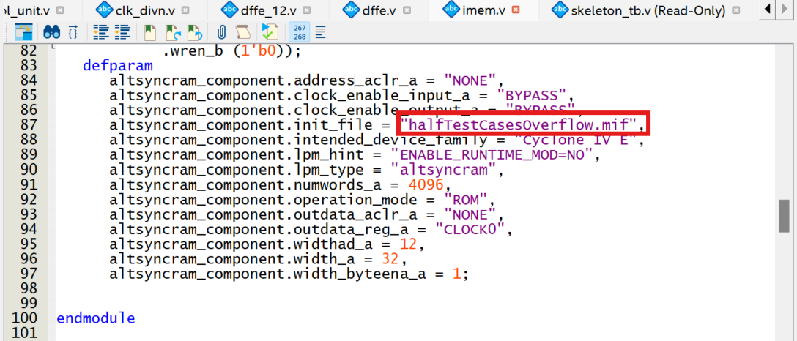

#### `halfTestCase.mif`:

```mif
-- null
DEPTH = 4096;
WIDTH = 32;

ADDRESS_RADIX = DEC;
DATA_RADIX = BIN;

CONTENT
BEGIN
    -- nop
0000 : 00000000000000000000000000000000;
    -- addi $1, $0, 65535      # r1 = 65535 = 0x0000FFFF
0001 : 00101000010000001111111111111111;
    -- sll $2, $1, 15			# r2 = r1 << 15 = 0x7FFF8000 = 2147450880(decimal)
0002 : 00000000100000100000011110010000;
    -- addi $3, $2, 32767		# r3 = r2 + 32767 = 0x7FFF8000 + 0x00007FFF = 0x7FFFFFFF(hex) = 2147483647(decimal)
0003 : 00101000110001000111111111111111;
    -- addi $4, $0, 1			# r4 = 1
0004 : 00101001000000000000000000000001;
    -- add $6, $1, $4			# r6 = 65535 + 1 = 65536  (normal addition) (then how about overflow addition?)
0005 : 00000001100000100100000000000000;
    -- sll $7, $4, 31			# r7 = r4 << 31 = 0x80000000(hex) = -2147483648(decimal)
0006 : 00000001110010000000111110010000;
    -- sub $9, $1, $4			# r9 = r1 - r4 = 65535 - 1 = 65534 (normal sub) (then how about overflow sub?)
0007 : 00000010010000100100000000000100;
    -- and $10, $1, $2			# r10 = r1 & r2 = 0x0000FFFF & 0x7FFF8000 = 0x00008000(hex) = 32768(decimal)
0008 : 00000010100000100010000000001000;
    -- or $12, $1, $2			# r12 = r1 | r2 = 0x0000FFFF | 0x7FFF8000 = 0x7FFFFFFF(hex) = 2147483647(decimal)
0009 : 00000011000000100010000000001100;
    -- addi $20, $0, 2         # r20 = 2
0010 : 00101101000000000000000000000010;
    -- add $21, $4, $20        # r21 = 3
0011 : 00000101010010010100000000000000;
    -- sub $22, $20, $4        # r22 = 1
0012 : 00000101101010000100000000000100;
    -- and $23, $22, $21       # r23 = 1 & 3 = 1
0013 : 00000101111011010101000000001000;
    -- or $24, $20, $23        # r24 = 2 | 1 = 3
0014 : 00000110001010010111000000001100;
    -- sll $25, $23,1          # r25 = 1 << 1 = 2
0015 : 00000110011011100000000010010000;
    -- sra $26, $25,1          # r26 = 2 >> 1 = 1 
0016 : 00000110101100100000000010010100;
    -- sw $4, 1($0)			# store 1 into address 1
0017 : 00111001000000000000000000000001;
    -- sw $20, 2($0)			# store 2 into address 2
0018 : 00111101000000000000000000000010;
    -- addi $27, $0, 456		# r27 = 456 
0019 : 00101110110000000000000111001000;
    -- sw $1, 0($27)			# store 65535 into address 456
0020 : 00111000011101100000000000000000;
    -- lw $28, 1($0)			# load 1 from address 1 into r28
0021 : 01000111000000000000000000000001;
    -- lw $29, 2($0)			# load 2 from address 2 into r29
0022 : 01000111010000000000000000000010;
    -- lw $19, 0($27)			# load 65535 from address 456 into r19
0023 : 01000100111101100000000000000000;
[0024 .. 4095] : 00000000000000000000000000000000;
END;
```

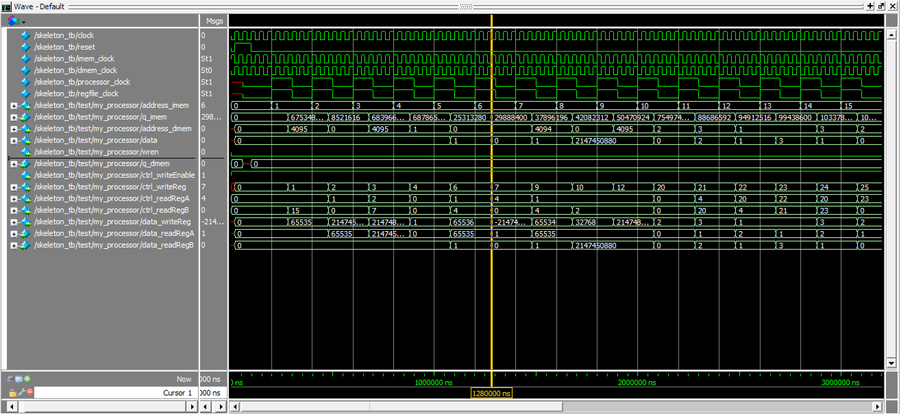

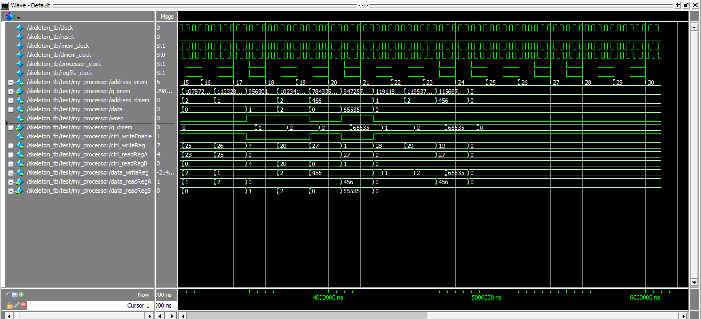

#### `halfTestCaseOverflow.mif`:

```mif
-- null
DEPTH = 4096;
WIDTH = 32;

ADDRESS_RADIX = DEC;
DATA_RADIX = BIN;

CONTENT
BEGIN
    -- nop
0000 : 00000000000000000000000000000000;
    -- addi $1, $0, 65535      # r1 = 65535 = 0x0000FFFF
0001 : 00101000010000001111111111111111;
    -- sll $2, $1, 15			# r2 = r1 << 15 = 0x7FFF8000
0002 : 00000000100000100000011110010000;
    -- addi $3, $2, 65535		# r3 = r2 + 65535 = overflow
0003 : 00101000110001001111111111111111;
    -- add $3, $2, $2			# overflow
0004 : 00000000110001000010000000000000;
    -- sll $4, $1, 16
0005 : 00000001000000100000100000010000;
    -- sub $5, $2, $4			# overflow
0006 : 00000001010001000100000000000100;
[0007 .. 4095] : 00000000000000000000000000000000;
END;
```

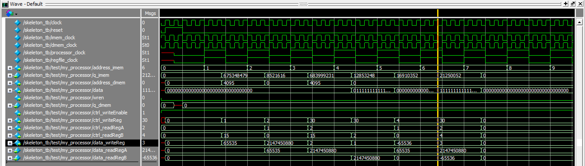

# PC5 - Full Processor


## My Design

> This design continues to use a 12-bit PC (corresponding to a 2^12 word addressable space), so all immediate values related to the PC are truncated to 12 bits.

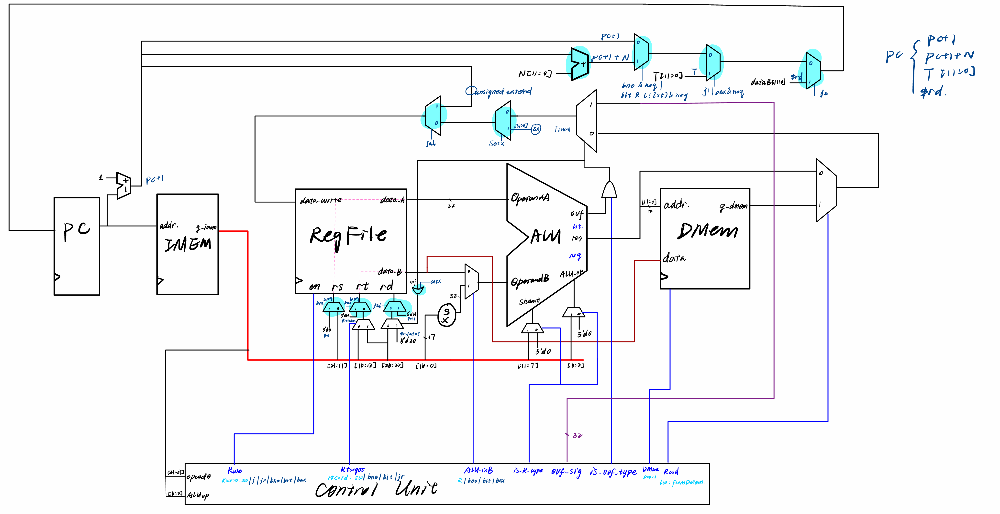

> 蓝色荧光部分是PC5对比PC4扩展的模块，蓝黑色部分是扩展的信号，都从 control unit 输出，图中为了简洁没有连线。

### Design Idea:

This work involves extending the instructions based on PC4. The design approach is to classify the instructions by their functionality and expand the existing PC accordingly.

#### Instructions Updating the PC:

- **PC = PC + 1**
- PC = PC + 1 + N
  - Includes `bne` (`bne & isNotEqual`) and `blt` (==`blt & isNotEqual & (~isLessThan)`==).
  - Implemented using a branch adder rather than reusing the ALU.
- PC = T
  - Includes `j`, `jal`, and `bex`.
- PC = $rd
  - Includes `jr`.

These PC value selections are implemented using multi-level multiplexers.

#### Storing Values into the RegFile:

- **jal**
- **setx**
- Other insns all have Rwe = 0.

#### Instructions Requiring RegFile Values for ALU Operations:

- **bne** (`$rd != $rs`)
  - `$rd` is passed through an existing multiplexer (designed for `sw` in PC4) to `ctrl_dataReadB`.
  - `$rs` is directly passed to `ctrl_dataReadA`.
  - The ALU's `isNotEqual` output is used as the result.
- ==**blt**== (`$rd < $rs`)
  - `$rd` is passed through the existing multiplexer to `ctrl_dataReadB`.
  - `$rs` is directly passed to `ctrl_dataReadA`.
  - The ALU’s `isLessThan` is used to compute `$rs < $rd`, and its negation (`~isLessThan`) determines `$rd >= $rs`.
  - Combined with the ALU's `isNotEqual` output to get the final result.
- **bex** (`$30` compared with `$0` for inequality)
  - Extend the inputs to `ctrl_dataReadA` and `ctrl_dataReadB` using multiplexers.
  - Use the ALU's `isNotEqual` output as the result.

#### Adding New Control Signals:

Each new instruction type requires a corresponding control signal, such as `jar`, `bex`, etc.

#### Updating Control Signals:

- **Rwe:**
  - In PC4, `Rwe = 0` only for `sw`.
  - In PC5, also `Rwe = 0` for `j`, `bne`, `blt`, `jr`, and `bex`.
- **Rtarget:**
  - In PC4, for `sw`, `rt <= rd`.
  - In PC5, also for `bne`, `blt`, and `jr`, `rt <= rd`.
- **ALU_in_B:**
  - In PC4, for R-type instructions, the ALU's operand B comes from the register; otherwise, it comes from the immediate value.
  - In PC5, this also applies to `bne`, `blt`, and `bex`.

## Code:

### Skeleton:

Same as  PC4

### Processor:

```verilog
/**
 * READ THIS DESCRIPTION!
 *
 * The processor takes in several inputs from a skeleton file.
 *
 * Inputs
 * clock: this is the clock for your processor at 50 MHz
 * reset: we should be able to assert a reset to start your pc from 0 (sync or
 * async is fine)
 *
 * Imem: input data from imem
 * Dmem: input data from dmem
 * Regfile: input data from regfile
 *
 * Outputs
 * Imem: output control signals to interface with imem
 * Dmem: output control signals and data to interface with dmem
 * Regfile: output control signals and data to interface with regfile
 *
 * Notes
 *
 * Ultimately, your processor will be tested by subsituting a master skeleton, imem, dmem, so the
 * testbench can see which controls signal you active when. Therefore, there needs to be a way to
 * "inject" imem, dmem, and regfile interfaces from some external controller module. The skeleton
 * file acts as a small wrapper around your processor for this purpose.
 *
 * You will need to figure out how to instantiate two memory elements, called
 * "syncram," in Quartus: one for imem and one for dmem. Each should take in a
 * 12-bit address and allow for storing a 32-bit value at each address. Each
 * should have a single clock.
 *
 * Each memory element should have a corresponding .mif file that initializes
 * the memory element to certain value on start up. These should be named
 * imem.mif and dmem.mif respectively.
 *
 * Importantly, these .mif files should be placed at the top level, i.e. there
 * should be an imem.mif and a dmem.mif at the same level as process.v. You
 * should figure out how to point your generated imem.v and dmem.v files at
 * these MIF files.
 *
 * imem
 * Inputs:  12-bit address, 1-bit clock enable, and a clock
 * Outputs: 32-bit instruction
 *
 * dmem
 * Inputs:  12-bit address, 1-bit clock, 32-bit data, 1-bit write enable
 * Outputs: 32-bit data at the given address
 *
 */
module processor(
    // Control signals
    clock,                          // I: The master clock
    reset,                          // I: A reset signal

    // Imem
    address_imem,                   // O: The address of the data to get from imem
    q_imem,                         // I: The data from imem

    // Dmem
    address_dmem,                   // O: The address of the data to get or put from/to dmem
    data,                           // O: The data to write to dmem
    wren,                           // O: Write enable for dmem
    q_dmem,                         // I: The data from dmem

    // Regfile
    ctrl_writeEnable,               // O: Write enable for regfile
    ctrl_writeReg,                  // O: Register to write to in regfile
    ctrl_readRegA,                  // O: Register to read from port A of regfile
    ctrl_readRegB,                  // O: Register to read from port B of regfile
    data_writeReg,                  // O: Data to write to for regfile
    data_readRegA,                  // I: Data from port A of regfile
    data_readRegB                   // I: Data from port B of regfile
);
    // Control signals
    input clock, reset;

    // Imem
    output [11:0] address_imem;
    input [31:0] q_imem;

    // Dmem
    output [11:0] address_dmem;
    output [31:0] data;
    output wren;	// DMen
    input [31:0] q_dmem;

    // Regfile
    output ctrl_writeEnable;	// Rwe
    output [4:0] ctrl_writeReg, ctrl_readRegA, ctrl_readRegB;
    output [31:0] data_writeReg;
    input [31:0] data_readRegA, data_readRegB;

    /* YOUR CODE STARTS HERE */
	 // wires
	 // PC
	 wire [11:0] pc_in, pc_out;	 
	 // PC5 extension
	 wire [11:0] pc_1, pc_1_N, pc_T, pc_rd;
	 // mux's out put
	 wire [11:0] pc_mux1, pc_mux2;
	 
	 // control unit
	 wire Rwe, Rtarget, ALUinB, DMwe, Rwd, is_R_type, is_ovf_type;
	 wire [31:0] ovf_sig;
	 wire ovf_ctrl;	// ovf && is_ovf_type
	 // PC5 extension
	 wire setx, bne, blt, j1, j2, jal, bex;
	 
	 // RegFile
	 wire [4:0] rd, rt;
	 // PC5 extension: 
	 // rd1: jal: write to $31
	 // rs, rt1: bex & isNotEqual: compare $0 to $30($rstatus)
	 wire [4:0] rd1, rs, rt1;
	 // PC5 extension: what to write back to $rd
	 wire [31:0] rw1, rw2;
	 
	 // ALU
	 wire overflow, isLessThan, isNotEqual;
	 wire [31:0] data_operandA, data_operandB, data_result;
	 wire [31:0] extend_immed;
	 wire [4:0] shamt, ALUop;
	 // PC5 extention
	 wire [31:0] extend_jump;	// JI-type
	 
	 // connection
	 // PC
	 adder_plus1 pc_incrementer(.in(pc_out), .out(pc_1));
	 dffe_12 pc(.d(pc_in), .q(pc_out), .clk(clock), .en(1'b1), .clr(reset));

	 // branch adder: (PC + 1) + (N: q_imem[16:0], truncated to [11:0])
	 RCA_12bit branch_adder(.a(pc_1), .b(q_imem[11:0]), .cin(0), .s(pc_1_N), .cout());
	 
	 // pc_mux1: branch or not. 1: pc+1+N, 0: pc+1
	 // branch = 1, when: bne & isNotEqual | blt & (~isLessThan) & isNotEqual
	 // blt: branch if $rt > $rs. isLessThan: $rs < $rt.
	 assign pc_mux1 = (((bne & isNotEqual) | (blt & (~isLessThan) & isNotEqual))) ? pc_1_N : pc_1;
	 
	 // pc_mux2: jump to T.
	 // j1(j | jal) | bex & isNotEqual = 1: T(q_imem[26:0] truncated to [11:0]), 0: pc_mux1
	 assign pc_mux2 = (j1 | bex & isNotEqual) ? q_imem[11:0] : pc_mux1;
	 
	 // pc_mux3: output connect to pc_in.
	 // j2(jr) = 1- jump to $rd, which is $rt(data_readRegB[11:0]), 0: pc_mux2
	 assign pc_in = j2 ? data_readRegB[11:0] : pc_mux2;
	 
	 // Imem
	 assign address_imem = pc_out;
	 
	 // control unit
	 control_unit myCtrl(
		.opcode(q_imem[31:27]), .ALUop(q_imem[6:2]), 
		.Rwe(Rwe), .Rtarget(Rtarget), .ALUinB(ALUinB), .DMwe(DMwe), .Rwd(Rwd), 
		.is_R_type(is_R_type), .is_ovf_type(is_ovf_type), .ovf_sig(ovf_sig),
		.setx(setx), .bne(bne), .blt(blt), .j1(j1), .j2(j2), .jal(jal), .bex(bex)
		);
		
	 and g1(ovf_ctrl, overflow, is_ovf_type);
	
	 // connect to module output
	 assign rt1 = Rtarget ? q_imem[26:22] : q_imem[16:12];
	 // rd1: write status code to $rstatus($30) when overflow
	 assign rd1 = (ovf_ctrl | setx) ? 5'd30 : q_imem[26:22];
	 // PC5 extension: write pc + 1 to $31 when jal
	 assign rd = jal ? 5'd31 : rd1;
	 // PC5 extension: bex & isNotEqual: compare $0 to $30($rstatus)
	 assign rs = bex & isNotEqual ? 5'd0 : q_imem[21:17];
	 assign rt = bex & isNotEqual ? 5'd30 : rt1;
	 
	 // RegFile
    assign ctrl_writeEnable = Rwe;
    assign wren = DMwe;
	 assign ctrl_writeReg = rd;
	 assign ctrl_readRegA = rs;
	 assign ctrl_readRegB = rt;
	 // PC5 extension
	 // rw mux1: 1x: ovf_sig, 01: q_dmem, 00: data_result(from alu)
	 assign rw1 = ovf_ctrl ? ovf_sig : (Rwd ? q_dmem : data_result);
	 // rw mux2: setx = 1: T[26:0] sign extended to T[31:0]; 0: rw1;
	 sign_extender_27to32 sx_jump (.immed(q_imem[26:0]), .extend_immed(extend_jump));
	 assign rw2 = setx ? extend_jump : rw1;
	 // rw mux_3: jal = 1: pc + 1 (higher 20 bits all 0, pc is unsigned); 0: rw2
	 assign data_writeReg = jal ? pc_1[11:0] : rw2;
	 
	 // ALU
	 sign_extender sx(.immed(q_imem[16:0]), .extend_immed(extend_immed));
	 
	 assign data_operandA = data_readRegA;
	 // PC5 extension: ALUinB = 1 ? extended_immed : data_readRegB
	 assign data_operandB = ALUinB ? extend_immed : data_readRegB;
	 assign shamt = is_R_type ? q_imem[11:7] : 5'd0;
	 assign ALUop = is_R_type ? q_imem[6:2] : 5'd0;
	 
	 alu myALU(
		.data_operandA(data_operandA), .data_operandB(data_operandB), 
		.ctrl_ALUopcode(ALUop), .ctrl_shiftamt(shamt), 
		.data_result(data_result), 
		.isNotEqual(isNotEqual), .isLessThan(isLessThan), .overflow(overflow)
		);
		
	 // Dmem
	 assign address_dmem = data_result[11:0];
	 assign data = data_readRegB;

endmodule
```

#### Sign_extender_27to32

```verilog
module sign_extender_27to32(immed, extend_immed);
	input [26:0] immed;
	output [31:0] extend_immed;
	
	assign extend_immed[26:0] = immed[26:0];
	assign extend_immed[31:27] = (immed[26]) ? 5'b11111 : 5'b00000;
	
endmodule
```

### Control Unit:

```verilog
module control_unit (opcode, ALUop, Rwe, Rtarget, ALUinB, DMwe, Rwd, is_R_type, is_ovf_type, ovf_sig,
							setx, bne, blt, j1, j2, jal, bex);
	input [4:0] opcode, ALUop;
	output Rwe, Rtarget, ALUinB, DMwe, Rwd, is_R_type, is_ovf_type;
	output [31:0] ovf_sig;	// add-1, addi-2, sub-3
	// PC5 extension
	output setx, bne, blt, j1, j2, jal, bex;
	
	assign is_R_type = opcode[4:0] ? 1'b0 : 1'b1;
	
	// DMwe-DataMem write enable
	// sw 	(1)
	// else 	(0)
	assign DMwe = (~opcode[4] & ~opcode[3] & opcode[2] & opcode[1] & opcode[0]) ? 1'b1 : 1'b0;
	
	// Rwd-Register write data
	// lw(01000): q_dmem			(1)
	// else: ALU's data_out		(0)
	assign Rwd = (~opcode[4] & opcode[3] & ~opcode[2] & ~opcode[1] & ~opcode[0]) ? 1'b1 : 1'b0;
	
	// overflow:
	// add(00000 00000): ovf_sig = 32'd1
	// addi(00101): ovf_sig = 32'd2
	// sub(00000 00001): ovf_sig = 32'd3
	assign is_ovf_type = ((is_R_type & ~ALUop[4] & ~ALUop[3] & ~ALUop[2] & ~ALUop[1]) 
								| (~opcode[4] & ~opcode[3] & opcode[2] & ~opcode[1] & opcode[0])) ? 1'b1 : 1'b0;
								
	assign ovf_sig = (is_R_type & ~ALUop[4] & ~ALUop[3] & ~ALUop[2] & ~ALUop[1] & ~ALUop[0]) ? 32'd1 :
						  ((is_R_type & ~ALUop[4] & ~ALUop[3] & ~ALUop[2] & ~ALUop[1] & ALUop[0]) ? 32'd3 :
						  ((~opcode[4] & ~opcode[3] & opcode[2] & ~opcode[1] & opcode[0]) ? 32'd2 : 32'd0));
	
	// PC5 extension
	// setx 10101
	assign setx = (opcode[4] & ~opcode[3] & opcode[2] & ~opcode[1] & opcode[0]) ? 1'b1 : 1'b0;
	
	// bne(00010)
	assign bne = (~opcode[4] & ~opcode[3] & ~opcode[2] & opcode[1] & ~opcode[0]) ? 1'b1 : 1'b0;
	
	// blt(00110)
	assign blt = (~opcode[4] & ~opcode[3] & opcode[2] & opcode[1] & ~opcode[0]) ? 1'b1 : 1'b0;
	
	// j1: j(00001), jal(00011) : 000x1
	assign j1 = (~opcode[4] & ~opcode[3] & ~opcode[2] & opcode[0]) ? 1'b1 : 1'b0;
	
	// j2: jr(0010)
	assign j2 = (~opcode[4] & ~opcode[3] & opcode[2] & ~opcode[1] & ~opcode[0]) ? 1'b1 : 1'b0;
	
	// jal: 00011
	assign jal = (~opcode[4] & ~opcode[3] & ~opcode[2] & opcode[1] & opcode[0]) ? 1'b1 : 1'b0;
	
	// bex: 10110
	assign bex = (opcode[4] & ~opcode[3] & opcode[2] & opcode[1] & ~opcode[0]) ? 1'b1 : 1'b0;
	
	// Rwe-Register write enable: 
	// sw(00111) - 0; other I/R-type - 1
	// PC5 extension: 
	// j(00001), bne, blt, jr(j2), bex(10110): 0
	assign Rwe = ((~opcode[4] & ~opcode[3] & opcode[2] & opcode[1] & opcode[0]) | 
					 (~opcode[4] & ~opcode[3] & ~opcode[2] & ~opcode[1] & opcode[0]) | bne | blt | bex) ? 1'b0 : 1'b1;
	
	// Rtarget-Register target: 
	// sw, bne, blt, j2(jr): rt <= $rd 	(1)
	//	other I/R-type: rt <= $rt  		(0)
	assign Rtarget = ((~opcode[4] & ~opcode[3] & opcode[2] & opcode[1] & opcode[0]) | bne | blt | j2) ? 1'b1 : 1'b0;
	
	// ALUinB-ALU Operand B:
	// R-type, bne, blt,: regfile_dataB 	(0)
	// bex: regfile_data							(0)
	// other I-type: extended imm 			(1)
	// other J-type: don't care				(1)
	assign ALUinB = (is_R_type | blt | bne | bex) ? 1'b0 : 1'b1;
	
endmodule
```

> 其他代码与 PC4 一致
>
> 

## Testbench

tb代码与上次一致

五分频：

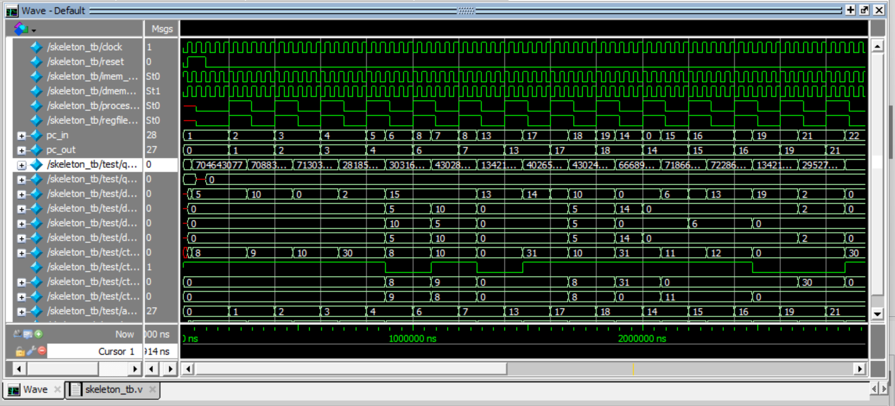

三分频：

50MHz / 3, 周期为 60ns

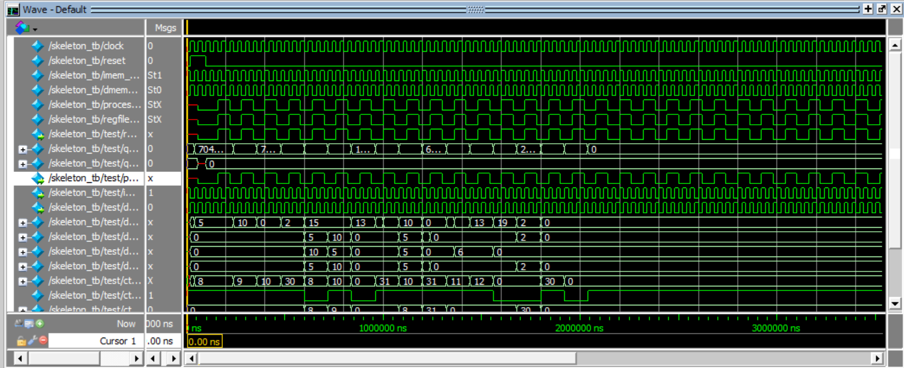

> 二分频肯定是不对的，参照PC4里的分频图，imem起码需要两个上升沿来执行读入和解码。三分配应该是上限了。
