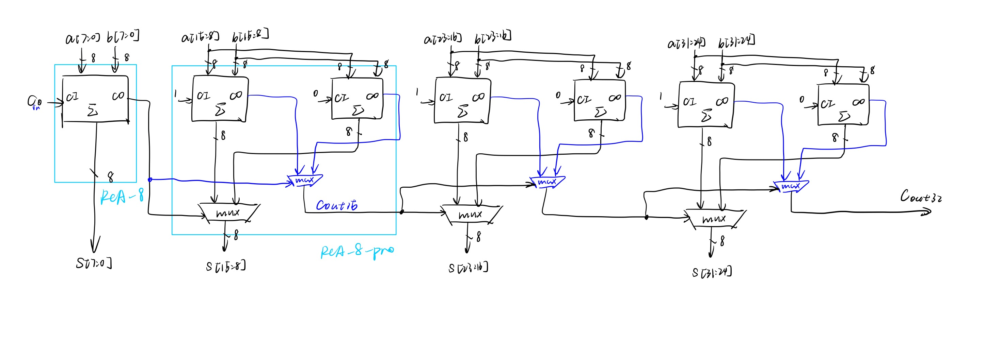
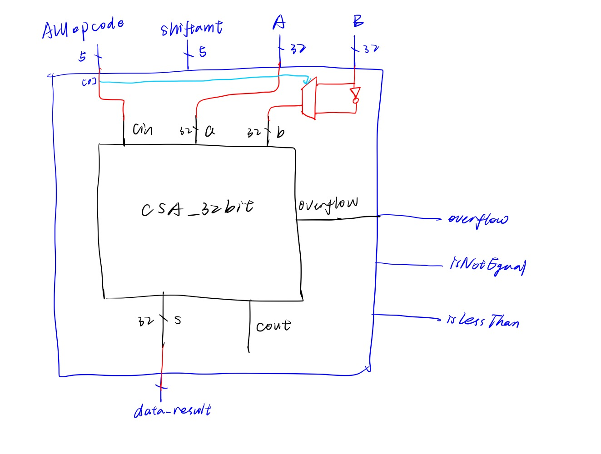

# add/sub base

Name: Sienna Zheng

NetID: sz318

## My Design

### 1. 32-bit adder：`CSA_32`

I designed a 32-bit Carry Select Adder (CSA) using four 8-bit Ripple Carry Adders (RCA). The structure design is in the following image (if you can see):

Below are the details of the structure:

- **Full Adder (`full_adder(a, b, cin, s, cout)`)**:
  - Inputs: `a`, `b` (operands), `cin` (carry-in)
  - Outputs: `s` (sum), `cout` (carry-out)
- **8-bit RCA (`RCA_8bit(a, b, cin, s, cout, overflow)`)**:
  - Built using 8 Full Adders.
  - `overflow` output is included for ALU integration.
- **8-bit RCA with carry prediction (`RCA_8bit_pro`)**:
  - An enhanced RCA with `cin` prediction.
- **2:1 Mux**:
  - Both 8-bit and 2-bit 2:1 multiplexers are used.
  - Implemented using conditional assignments.
- **32-bit CSA (`CSA_32bit`)**:
  - Created by combining four 8-bit RCAs.
  - Compared to a 32-bit RCA, this design reduces delay with a tolerable amount of additional hardware

## 2 ALU with overflow implementation `alu`

The structure design is in the following image (if you can see):

**Implementation Details**:

- A 32-bit bitwise NOT operation: Controlled by `ctrl_ALUopcode[0]`, which determines whether `data_operandB` should be bitwise negated.
- 32-bit adder (`CSA_32bit`): Performs addition on the operands and handles the overflow signal.

##### overflow detection:

- detect signed addition overflow: CI != CO of the last bit addition (XOR CI and CO of the last bit addition)
